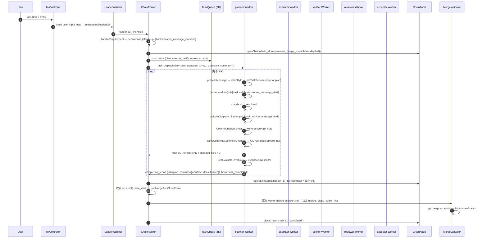

# Eval 02 — Leader ↔ Worker 通信全链路

> **场景**：在已经按 [`01-startup-worker-6.md`](./01-startup-worker-6.md) 验证过的 6 worker 启动稳定态下，用户在 TUI INPUT 行键入一条需求字符串后回车，触发完整的 `plan → execute → verify → review → accept` 责任链。
>
> **目的**：把 Leader 与 Worker 之间的消息流、Hook 触发、Worktree commit + Docs commit 双轨、上下文承接（rebase + upstream_commits + chain artifacts）、责任链 audit 五件事拆成可观察的中间态与最终态，对照 `CLAUDE.md` / `docs/v0.7/dd/` 的"预期"和 `packages/*/src/` 的"实际"，差异处给出判定与修复方案。
>
> **本文是纸面静态推导验证**。真机运行的中间文件、ZK 节点 dump、Hook stdout 等留待后续 [`02-leader-worker-communication-runtime.md`](./02-leader-worker-communication-runtime.md) 回填（§9）。

---

## 1. 范围

### 1.1 用户行为

启动稳定后（6 worker idle），用户在 TUI INPUT 行键入需求并回车，例如：

```
帮我把 packages/leader/src/state.ts 的 selected 字段重命名为 focused_index
```

### 1.2 前置条件

- 已经按 eval 01 验证过启动；6 worker `status="idle"`，pending/in_progress 任务都为空。
- `worker-decompose.md` 模板存在于 `<worktree>/.claude-orchestrator/agents/` 或 `templates/agents/`（Leader 端会自检 `template_engine.has("worker-decompose.md")`，见 `packages/leader/src/chain-router.ts:427`），否则走 forward-to-planner 兜底路径。
- `magic_mode=false`（不覆盖 `explore` link 与 `spawn_chain`）。

### 1.3 不覆盖

- TUI 渲染细节、键盘输入路由（留待 03-tui-input eval）。
- `--magic` / `spawn_chain` 分支与链森林（留待 04-magic-loop eval）。
- `merge_failed` 重派与 `merge_decision_made` hook 的 `CO_DECISION`（留待 05-merge-failure eval）。
- 真机运行的 PID、时长、日志体量（留待 `02-...-runtime.md`）。

---

## 2. 整体时序



---

## 3. Message 路由

### 3.1 ZK 路径与 schema

**实际路径模板**（`packages/contracts/src/paths/zkPaths.ts:14-53`）：

| 用途 | 路径 |
|------|------|
| 项目根 | `/claude-orchestrator`（或 `/co/{project_id}` 当 `ZkPathOptions.project_id` 注入时） |
| Leader 节点 | `/claude-orchestrator/leader` |
| Worker / Leader 实例 | `/claude-orchestrator/instances/{instance_id}` |
| 待领 / 已领 / 完成任务 | `/claude-orchestrator/tasks/{pending,claimed,completed}/...` |
| **消息收件箱** | `/claude-orchestrator/messages/{instance_id}/{msg_id}` |

**Message payload schema**（`packages/contracts/src/schemas/message.ts:20-48`）：

| 字段 | 类型 | 何时填写 |
|------|------|---------|
| `id` | MessageId | `MessageRouter.send` 写入时由 ZK `createPersistentSequential("msg-", ...)` 生成 |
| `type` | `direct \| broadcast \| task_dispatch \| completion_report \| user_input \| memory_refresh` | 由发送方填 |
| `from_instance / from_name / from_role` | branded ID + string | 必填 |
| `to_instance / to_name` | nullable | broadcast 时为 null |
| `content` | string | 任意；ChainDef / EvalDecision 时序列化为 JSON 文本 |
| `link` | `TaskLink \| null` | 决定 ChainRouter 的分派分支（§3.2） |
| `task_id / chain_id` | branded ID \| null | task_dispatch / completion_report 必填 |
| `task_title / task_description / task_criteria` | nullable string | task_dispatch 携带的"原始任务声明"（来自 ChainDef） |
| `result_path` | nullable string | completion_report 指向 `tasks/{task_id}/result.md` |
| `original_requirement_path` | nullable string | 每个 task_dispatch 都携带；指向 `chains/{chain_id}/requirement.md` |
| `upstream_commits` | optional `UpstreamCommits` | activate_next 派发时由 `ChainAudit.collectUpstreamCommits` 填充 |
| `spawned_from / next_requirement` | optional | v0.7 magic 模式专用，本场景不覆盖 |
| `reply_to / read / created_at` | 其它管理字段 | — |

**MessageRouter API**（`packages/coordination/src/message-router.ts`）：

| 方法 | 行号 | 行为 |
|------|------|------|
| `send` | `:48-82` | 校验 `to_instance` 必填；JSON 编码 payload；`createPersistentSequential("msg-", ...)`；`read: false` |
| `poll` | `:84-106` | 拉取所有子节点排序解码；返回时**已经 set read=true** |
| `waitForMessage` | `:108-128` | 初始 poll + ZK watch loop；通过 callback 投递新消息 |
| `dismiss` | `:130-134` | 删除 ZK 节点；Worker 处理完一条消息后调一次 |

### 3.2 LeaderWatcher → ChainRouter 分派矩阵

`packages/leader/src/watcher.ts:22-77` 把 inbound 消息原样转交给 `ChainRouter.route(msg)`（Leader 仅做去重 + EventBus 通知，**不解释 msg.content**）。`ChainRouter.route`（`chain-router.ts:262-280`）按以下顺序判断：

| 条件 | 分支 | 代码位置 |
|------|------|---------|
| `msg.type === "memory_refresh"` | `handleMemoryRefresh` | `:263-265` |
| `!msg.link` | `handleRequirement`（含 slash-command 与 decompose） | `:267-269` |
| `msg.link === "plan" && msg.type === "completion_report"` | `handleCompletionReport`（短路 looksLikeChainDef，避免把 plan 完成报告误识别为 ChainDef） | `:271-273` |
| `looksLikeChainDef(msg.content)` | `handleTaskDefinitions`（plan worker 把 ChainDef 直接回传） | `:275-278` |
| 其它 | `handleCompletionReport`（兜底） | `:279` |

> **注意**：`handleRequirement` 进一步分裂为两条路径——`/init` 等 slash-command 在 `:294-305` 处理；纯需求文本在 `:427` 检查模板存在性，决定**Leader 本地 decompose**（`:454-476`）还是**forward 给空闲 planner**（`:486-500`）。

### 3.3 Worker 端 ZK watch + 任务校验

`packages/worker/src/watcher.ts:139-149` 用 `inFlight Set` 去重并发起 `waitForMessage`。`processMessage`（`:155-189`）→ `processTask`（`:191-613`）的关键拦截点：

| # | 观察点 | 代码位置 | 行为 |
|---|--------|----------|------|
| 1 | 标记 busy | `:168-175` | `registry.heartbeat({status:"busy", current_task_id:realTaskId})` |
| 2 | **assigned_to 校验** | `:215-228` | 若 `pending.assigned_to && pending.assigned_to !== self` → `dismiss(msg)` 并 `return`（**Leader 必须先 `task_queue.assign` 再 `task_dispatch`**，详见 §6.1） |
| 3 | `claimById` | `:229-237` | ZK 原子 `create EPHEMERAL`；失败则记 warn 但继续（已被另一进程领走或已完成） |
| 4 | 触发 `task_claimed` hook | `:239-249` | 仅在成功 `claimById` 时 fire |
| 5 | preTaskRebase | `:252-303` | §6.2 详述 |
| 6 | 渲染 + claude -p（最多 3 次） | `:338-422` | §6.3/§6.4 详述 |
| 7 | CommitChecker / DocsCommitter | `:469-549` | §5 详述 |
| 8 | sendCompletionReport / sendForcedFeedbackReport | `:551-576, :683-749` | §5.3 详述 |
| 9 | `task_queue.complete` + `task_completed` hook | `:580-607` | 写 `/tasks/completed/{task_id}` + 删 claimed 节点 |
| 10 | `dismiss(msg.id)` | `:609` | 必在最后；保证幂等 |

### 3.4 三类核心消息的字段实际写入表

> 字段未列出的均为 schema default（null/false/""）。

| 字段 | `user_input`（TUI → Leader） | `task_dispatch`（Leader → Worker） | `completion_report`（Worker → Leader） |
|------|---|---|---|
| `from_instance / from_name / from_role` | `leader_id / leader_name / "leader"`（TUI 的 dummy from） | `leader_id / leader_name / "leader"` | `worker.instance_id / worker.name / worker.role` |
| `to_instance / to_name` | `leader_id / leader_name`（自投递） | `worker.id / worker.name` | `leader_id / null` |
| `type` | `user_input` | `task_dispatch` | `completion_report` |
| `content` | 用户原文 | `nextTask.title`（任务标题；详细描述在 `task_description`） | EvalDecision JSON 字符串 + `commits` 字段 |
| `link` | `null` | `nextLink`（`plan` / `execute` / ...） | 已完成的 link |
| `chain_id` | `null` | `msg.chain_id` | `msg.chain_id` |
| `task_id` | `null` | `nextTask.id` | `taskId` |
| `task_title / task_description / task_criteria` | `null` | 来自 ChainDef 的对应 link.task | `null`（已在 result.md 落盘） |
| `result_path` | `null` | `null` | `tasks/{task_id}/result.md` 的绝对路径 |
| `original_requirement_path` | `null` | `chains/{chain_id}/requirement.md`（`chain-router.ts:907`） | `null` |
| `upstream_commits` | `undefined` | `ChainAudit.collectUpstreamCommits(chain_id)`（仅含已有 worktree SHA 的 link） | `undefined` |

---

## 4. Hook 触发

### 4.1 实际触发点全表

**实际事件清单**（`packages/contracts/src/hooks.ts:62-71`）— 共 **8** 个：

| # | 事件 | 触发文件 / 行号 | 触发者 | 阻塞主流程？ |
|---|------|----------------|-------|-------------|
| 1 | `leader_message_start` | `packages/leader/src/chain-router.ts:454` | Leader（decompose claude-cli 前） | 否（`hooks.fire` await，但 HookEngine 内部 fire-and-forget） |
| 2 | `leader_message_end` | `chain-router.ts:466` | Leader（decompose 后） | 否 |
| 3 | `worker_message_start` | `packages/worker/src/watcher.ts:322-333` | Worker（任务 claude-cli 前） | 否 |
| 4 | `worker_message_end` | `watcher.ts:424-436` | Worker（claude-cli 返回后，无论成败） | 否 |
| 5 | `task_claimed` | `watcher.ts:239-248` | Worker（`task_queue.claimById` 成功后） | 否 |
| 6 | `task_completed` | `watcher.ts:590-600` | Worker（`task_queue.complete` 之后） | 否 |
| 7 | `chain_activated` | `chain-router.ts:702-707` | Leader（openChain + push tasks 之后） | 否 |
| 8 | `merge_decision_made` | （声明但未触发） | — | — |

**HookEngine 执行机制**（`packages/runtime/src/hook-engine.ts:38-75`）：

- `sh -c <script>`、`stdio: "ignore"`、`detached: true` + `child.unref()`（`:44-47, :72-73`）
- `setTimeout(HOOK_TIMEOUT_MS=5000)`（`:16, :50-58`）超时 → SIGKILL + warn
- `child.on("error")` → warn + resolve（`:60-66`）
- `child.on("exit")` → **直接 resolve，不区分 exit code，不 emit 任何事件**（`:67-70`）
- Hook 配置来自 5 层 config 合并后的 `ResolvedConfig.hooks`，通过 `ChildConfig.hooks` 注入到 Worker child（`packages/worker/src/child-runner.ts`）

### 4.2 `CO_*` env 变量按事件类型分类

**实际**（`packages/contracts/src/hooks.ts:9-58`）：所有事件都额外自带 `CO_EVENT=<event_type>`（`hook-engine.ts:45`）。

| 事件 | env 字段 |
|------|---------|
| `leader_message_start` | `CO_LEADER_ID, CO_MESSAGE_ID, CO_LINK, CO_LOG_PATH` |
| `leader_message_end` | 上 + `exit_code: number` |
| `worker_message_start` | `CO_WORKER_NAME, CO_WORKER_ID, CO_TASK_ID, CO_LINK, CO_CHAIN_ID, CO_LOG_PATH, CO_RESULT_PATH` |
| `worker_message_end` | 上 + `exit_code: number` |
| `task_claimed` | `CO_WORKER_NAME, CO_WORKER_ID, CO_TASK_ID, CO_LINK, CO_CHAIN_ID` |
| `task_completed` | 上 + `duration_seconds: number \| null` |
| `chain_activated` | `CO_CHAIN_ID`（仅一个） |
| `merge_decision_made` | `CO_DECISION, CO_BRANCH, CO_REASON`（声明，未触发） |

> `flattenEnv`（`hook-engine.ts:78-85`）把 env 字典里的 null/undefined 转换为空字符串后再合并到 `process.env`，所以 shell 脚本里读到的总是 string。

### 4.3 设计 vs 实现的差异（见 §8.1 / §8.2 / §8.5）

---

## 5. Worktree commit + Docs commit（双轨）

### 5.1 CommitChecker

**实际**（`packages/worker/src/commit-checker.ts:40-107`）：

| # | 步骤 | 代码位置 | 行为 |
|---|------|----------|------|
| 1 | `git status --porcelain` | `:44-48` | 在 worktree 内执行 |
| 2 | 无变更 → 返回 `null` | `:49-52` | log `"no changes to commit"` |
| 3 | `parseStatus` 解析 changed / untracked / paths（rename 拆 src+dst） | `:54, :155-189` | — |
| 4 | `parseStatus` 解析后无可提交 paths → 返回 `null` | `:55-61` | log `"no commit-worthy paths after status parse"` |
| 5 | 生成 commit message | `:62, :109-142` | 模板 `worker-commit-message.md` 走 claude-cli 一次（resume session），失败回落到 `chore: auto-commit from {worker_name}` |
| 6 | `git add -- <paths>` | `:68-71` | **显式 path 而非 `-A`**——避免误提 .env / token.json |
| 7 | `git commit -m <message>` | `:72-75` | — |
| 8 | 任一 git 调用非零 → `throw CommitFailedError` | `:76-93` | 由调用方 `processTask` 捕获 → 强制 feedback（`watcher.ts:551-562`） |
| 9 | `git rev-parse HEAD` → `sha` | `:95-99` | 返回 `CommitResult{sha, message, changed_files, untracked_files}` |

> **关键设计点**：commit 失败（非"无变更"）必须以 `CommitFailedError` 抛出，Worker 端把这条 link 的报告转成 **feedback decision** 而不是 activate_next，避免 close_chain 阶段 MergeValidator 因为缺 commit 而跳过该 link。见 `commit-checker.ts:77-93` 与 `watcher.ts:552-562` 的注释。

### 5.2 DocsCommitter

**实际**（`packages/worker/src/docs-committer.ts:49-130`）：

| # | 步骤 | 代码位置 | 行为 |
|---|------|----------|------|
| 1 | 检查 `<co_root>/docs/<worker_name>/` 是否存在 | `:53-58` | 不存在直接返回 `null` |
| 2 | `git status --porcelain -- docs/<worker_name>` | `:60-68` | **scope 限定**到本 worker 子目录 |
| 3 | 无变更 → `null` | `:69-72` | — |
| 4 | `parseStatusPaths` | `:74, :172-191` | 同 CommitChecker，rename 拆 src+dst |
| 5 | 生成 commit message | `:82, :132-169` | 复用 `worker-commit-message.md`；写入 `<task_dir>/docs-commit.msg` |
| 6 | `git add -- <paths>` | `:91-94` | scope 限定 |
| 7 | `git commit --only -F <msgfile> -- <paths>` | `:99-106` | **`--only` 关键**：只提交指定 paths，忽略其它并发 worker 的已 staged 内容；`.git/index.lock` 提供跨进程互斥 |
| 8 | 任一 git 调用非零 → 返回 `null`（best-effort） | `:107-117` | log error 但**不**抛出；docs commit 失败不阻断 worktree commit / completion report |
| 9 | `git rev-parse HEAD` → 返回 `sha` | `:119-129` | — |

### 5.3 commits envelope 注入 completion_report

`packages/worker/src/watcher.ts:683-749` — `sendCompletionReport`：

1. 调 `evaluator.evaluate(...)` 拿到 EvalDecision JSON 字符串（`:692-703`）。
2. 若 `commit || docsSha` 存在，**尝试 JSON.parse evalContent 并注入两个字段**（`:705-735`）：
   ```jsonc
   {
     "decision": "...",
     "reason": "...",
     // ↓ 新版双轨 envelope
     "commits": {
       "worktree": "<commit.sha or null>",
       "docs":     "<docsSha or null>",
       "branch":   "<this.opts.worktree_branch>"   // e.g. "claude-orchestrator/Tom-workspace"
     },
     // ↓ legacy 字段（仅 commit 非 null 时）
     "commit": { "sha", "message", "branch", "changed_files", "untracked_files" }
   }
   ```
   JSON.parse 失败时回落到文本附加 `\nCommit: <short_sha> - <message>\nDocs commit: <short_sha>`（`:728-734`）。
3. 发送 `completion_report` 消息到 Leader 收件箱（`:737-748`）。

### 5.4 ChainAudit.recordLinkCommit 落 manifest.link_commits

`packages/leader/src/chain-router.ts:760-805` — `handleCompletionReport` 在解析 EvalDecision 之后：

1. legacy `commit` 字段 → `recordCommit(chain_id, link, title, {sha, message, branch?})`（`:764-772`）用于 MergeValidator 旧路径。
2. 新版 `commits` envelope → `ChainAudit.recordLinkCommit(chain_id, link, {worktree, docs, branch})`（`:782-805`）落到 `manifest.link_commits[link]`（`chain-audit.ts:244-268`）。

随后 `:807-816` 把 `completion_report` 事件 append 到 `audit.jsonl`，payload 仅含 `decision` 字段。

---

## 6. 下游 Worker 的上下文承接

### 6.1 upstream_commits 通过 task_dispatch 注入

`chain-router.ts:858-912` — `activate_next` 分支：

1. 找/造 pending task（`findOrCreatePendingTask`，`:862-865`）。
2. 找空闲 worker by role（`findIdleWorkerByRole(LINK_TO_ROLE[nextLink])`，`:866`）。
3. **必须先 `task_queue.assign(nextTask.id, worker.id, worker.name)`**（`:872`）。Worker 端 §3.3 step 2 会校验 `assigned_to == self`，没 assign 就 dispatch 会被 dismiss。
4. `ChainAudit.setLinkTask + audit('task_dispatch')`（`:873-885`）。
5. `collectUpstreamCommits(chain_id)`（`:891-893` → `chain-audit.ts:275-286`）返回 `UpstreamCommits` map（仅含 `worktree` 非 null 的 link）。
6. 发送 `task_dispatch` 携带 `upstream_commits`、`original_requirement_path`、`task_title/description/criteria`（`:894-909`）。
7. `rememberDispatch(chain_id, nextLink, worker.id)`（`:910`）— 记到 manifest.link_workers，feedback 路由用得上。

### 6.2 preTaskRebase 选 immediate predecessor

`packages/worker/src/watcher.ts:252-303` + 辅助函数 `pickImmediatePredecessor`（`:63-97`）：

- **算法**：upstream 顺序写死 `["plan","execute","verify","review","accept"]`（`:77-83`）。
  - `link === "plan"` → 返回 `null`，不 rebase。
  - `link === "explore"`（magic 专用） → 从 accept 往回找第一个非空 worktree SHA。
  - 其它 link → 从自己 index - 1 往回找第一个非空 worktree SHA（**容忍空洞**：plan 不动代码 → execute 直接 rebase 到 plan 之前的 base，依此类推）。
- **rebase 流程**：`preTaskRebase(predecessor)` → 检查 ancestor 跳过 / `git fetch <remote>` 可选 / `git rebase <sha>`。
- **冲突处理**（`:271-296`）：抛 `RebaseConflictError` → 调 `sendForcedFeedbackReport` 把这条 link 强制转成 `feedback` 决策回给 Leader（**不**自动续走 `claude -p`，避免吞掉上游变更）。

### 6.3 collectChainArtifacts 把上游 result.md 路径塞进模板变量

`packages/worker/src/watcher.ts:622-681` — 读 `<co_root>/chains/{chain_id}/manifest.json` 的 `link_tasks`，按当前 link 的位置返回上游每条 link 的 `tasks/{task_id}/result.md` 绝对路径：

| 当前 link | 模板里能拿到的上游 artifact |
|-----------|---------------------------|
| `plan` | 空（首链） |
| `execute` | `plan` |
| `verify` | `plan, execute` |
| `review` | `plan, execute, verify` |
| `accept` | `plan, execute, verify, review` |
| `explore` (magic) | `plan, execute, verify, review, accept`（全量） |

### 6.4 worker-{role}-task.md 模板变量约定

`watcher.ts:338-369` 渲染 `LINK_TO_TASK_TEMPLATE[link]`（`:35-43`）时注入的变量集合（**所有 5 套 task 模板共用这个变量名空间**）：

| 变量 | 来源 |
|------|------|
| `name, role, date, unique_key` | Worker 自己 + ISO date + `chain_id` |
| `task_title, task_description, task_criteria` | `msg.*` |
| `result_path` | `tasks/{task_id}/result.md` 的绝对路径 |
| `local_doc_path` | `<co_root>/docs/<worker_name>/<date>/<link>-<chain_id>.md`（DocsCommitter 提交的 target） |
| `work_dir` | Worker 自己的 worktree 绝对路径 |
| `time, content, original_requirement_path` | 直接来自 msg |
| `upstream_{plan,execute,verify,review,accept}_artifact` | §6.3 返回值（空串 if 缺） |
| `upstream_{plan,execute,verify,review,accept}_commit` | `msg.upstream_commits[link]`（空串 if 缺） |
| `workspace_memory_path` | `<co_root>/memory/` |
| `retry_hint` | 第 1 次 attempt 为空；后续重试时填上一次失败原因（`watcher.ts:419-421`） |

---

## 7. 责任链可追溯

### 7.1 ChainManifest 字段全表（实际）

`packages/leader/src/chain-audit.ts:35-57` 与 `:137-167`（openChain 写入时）：

| 字段 | 类型 | 写入时机 | 写入者 |
|------|------|---------|--------|
| `chain_id` | `ChainId` | openChain | ChainAudit |
| `created_at` | ISO-8601 | openChain | ChainAudit |
| `completed_at` | ISO-8601 \| null | closeChain | ChainAudit |
| `status` | `running \| completed \| failed \| aborted \| merge_failed` | open / close | ChainAudit |
| `leader_id / leader_name` | branded ID + string | openChain | 由 ChainRouter 传入 |
| `requirement_path` | string | openChain | ChainAudit |
| `link_tasks{plan,execute,verify,review,accept,explore}` | `TaskId \| null` | activate_next 派发后 `setLinkTask` | ChainRouter |
| `link_workers{plan,execute,verify,review,accept,explore}` | `InstanceId \| null` | rememberDispatch → `setLinkWorker` | ChainRouter |
| `link_commits{plan,execute,verify,review,accept,explore}?` | optional `LinkCommitRecord` | completion_report 到达 → `recordLinkCommit` | ChainRouter |
| `total_retry_count` | int | feedback 派发前 `incrementRetry` | ChainRouter |
| `max_total_retries` | int | openChain（`DEFAULT_MAX_TOTAL_RETRIES=9` 或来自 env） | ChainAudit |
| `parent_chain_id` | `ChainId \| null` | openChain（v0.7） | ChainAudit |
| `child_chain_ids[]` | `ChainId[]` | `appendChildChain`（spawn_chain 时） | ChainRouter |
| `chain_depth` | int | openChain | ChainAudit |
| `magic_mode` | boolean | openChain | ChainAudit |

`LinkCommitRecord`（`chain-audit.ts:29-33`）：`{ worktree: string \| null, docs: string \| null, branch: string }`。

### 7.2 audit.jsonl 实际事件类型

**实际**（`chain-audit.ts:75-91`）— 共 **14** 个 + record 落盘格式（`:356-377`）：

```
requirement_received, chain_opened, task_dispatch, completion_report,
feedback_sent, feedback_unresolved, chain_id_conflict, merge_failure,
retry_ceiling_exceeded, chain_closed, validation_failure, invalid_decision,
chain_spawned, chain_spawned_from, magic_depth_exhausted
```

落盘格式（`record`，`:356-377`）：`{ts, chain_id, event, link, worker_id, worker_name, task_id, payload}` 一行一条 JSON，append-only，`<co_root>/chains/{chain_id}/audit.jsonl`。

### 7.3 三件套（manifest / audit / requirement.md）写入纪律

| 文件 | 写入者 | 操作 | 容错 |
|------|--------|------|------|
| `<co_root>/chains/{chain_id}/manifest.json` | ChainAudit | **整文件覆写**（`writeFile`，非原子 rename） | 并发写来自单 Leader 进程，串行执行 |
| `<co_root>/chains/{chain_id}/audit.jsonl` | ChainAudit.record | **append** | 失败仅 log warn |
| `<co_root>/chains/{chain_id}/requirement.md` | ChainAudit.openChain | 一次性写入 | — |

> **manifest 写入不是原子 rename**（仅 `fs.writeFile`，见 `chain-audit.ts:168-172, :263-267, :315-319, :349-353`）。DD §1.4 提到 `writeManifestAtomic = writeFile(*.tmp) + rename(*.tmp, *)`，但代码没有 .tmp + rename。详见 §8.6。

---

## 8. 差异汇总（核心交付物）

> 每条差异给出"判定 + 修复方案"。**判定**：以代码为准 = 文档落后；以文档为准 = 代码 bug；两边都对 = 缺补充。**修复方案**给出具体到段落锚的文件路径。

### 8.1 Hook 事件清单 drift

| 项 | 预期（DD `09-audit-and-cache.md` §6.1） | 实际（`packages/contracts/src/hooks.ts:62-71`） |
|----|--------------------------------------|------|
| 事件总数 | 6（worker_message_start/end、task_claimed、task_completed、内置 `task_recovered`、`task_failed`） | **8**（leader_message_start/end、worker_message_start/end、task_claimed、task_completed、chain_activated、merge_decision_made） |
| 多出来的 | — | `leader_message_start/end`、`chain_activated`、`merge_decision_made` |
| 少掉的 | — | `task_recovered`、`task_failed`（被改为 LeaderEventBus 内存事件，不进 hook） |
| 实际未触发的 | — | `merge_decision_made`（声明在 HookEventType 但 `grep -n "merge_decision_made" packages/leader/src/` 无 hits） |

**判定**：以**代码为准**。v0.7 把 task/worker 生命周期事件从 hook 拆分到了 LeaderEventBus（供 TUI 渲染），并新增了 leader 侧 hook 与 chain 维度 hook。

**修复方案**：
- 改 `docs/v0.7/dd/09-audit-and-cache.md` §6.1 的事件表为 8 行实际事件，删除 `task_recovered/task_failed`。
- §6.1 把 `merge_decision_made` 标注 "声明但 v0.7 未触发；预留供 MergeValidator 改造时启用"。
- 同步 `CLAUDE.md` 的 HookEngine 段落（当前文案 `Pre/post lifecycle hooks with CO_* env vars`，可补一句 "8 个 hook 事件，详见 docs/v0.7/dd/09-audit-and-cache.md §6.1"）。

### 8.2 `CO_*` env 变量命名 drift

| 项 | 预期（DD §6.3） | 实际（`packages/contracts/src/hooks.ts:9-58`） |
|----|---------------|------|
| Worker 实例 ID | `CO_INSTANCE_ID` | **`CO_WORKER_ID`** |
| Worker role | `CO_WORKER_ROLE`（所有事件） | **未注入** |
| 协议号 | `CO_PROTOCOL_VERSION`（所有事件） | **未注入** |
| Message ID | `CO_MESSAGE_ID`（所有事件） | **仅 `leader_message_*`** |
| 日志 / 结果路径 | DD 未列 | `CO_LOG_PATH`（leader_/worker_message_*）、`CO_RESULT_PATH`（worker_message_*） |
| 任务耗时 | `task_completed` 中 `CO_DECISION` | **`duration_seconds`**（数字 \| null），无 CO_DECISION |
| 通用 | `CO_EVENT`（所有事件） | ✅ 与 DD 一致（`hook-engine.ts:45`） |

**判定**：以**代码为准**。`CO_WORKER_ID` 等是稳定名；DD §6.3 落后于 v0.7 hook 拆分。

**修复方案**：改 `docs/v0.7/dd/09-audit-and-cache.md` §6.3 为"按事件类型分组"，复刻 §4.2 表（本文 §4.2）。删除 `CO_INSTANCE_ID / CO_WORKER_ROLE / CO_PROTOCOL_VERSION` 行，新增 `CO_LOG_PATH / CO_RESULT_PATH / duration_seconds` 行。

### 8.3 audit.jsonl 事件类型 drift

| 项 | 预期（DD §4.2 / §4.3） | 实际（`chain-audit.ts:75-91`） |
|----|---|---|
| 失败 merge 事件名 | `chain_merge_failed` | **`merge_failure`** |
| task 生命周期事件 | `task_claimed / task_recovered / task_failed` | **未落 audit**（这些事件落 LeaderEventBus，由 §8.1 同因引发） |
| merge 流程事件 | `merge_validation_started / merge_validation_completed` | **未落 audit**（用 `merge_failure` + `chain_closed` 即可） |
| worker 监控事件 | `worker_left` | **未落 audit**（落 LeaderEventBus） |
| v0.7 新增 | `chain_spawned / chain_spawned_from / magic_depth_exhausted / invalid_decision / validation_failure` | ✅ 已实现（DD §4.3 部分覆盖） |

**判定**：以**代码为准**。audit.jsonl 是 chain 维度的"持久化日志"，task / worker 维度事件按设计应该走 LeaderEventBus + TUI，不污染 chain audit。

**修复方案**：改 `docs/v0.7/dd/09-audit-and-cache.md` §4.2 事件表为代码里的 14 个事件；§4.3 内容并入 §4.2；`chain_merge_failed → merge_failure` 重命名。补一行 NOTE "task lifecycle / worker_left 事件在 LeaderEventBus 内存事件流，不进 audit.jsonl"。

### 8.4 ChainManifest 字段 drift

| 项 | 预期（DD `09-audit-and-cache.md` §1.3 / §1.4） | 实际（`chain-audit.ts:35-57, :137-167`） |
|----|---|---|
| `protocol_version` | 每条 manifest 都带 `"0.7.0"` | **未持久化**（leader EPHEMERAL `/leader` 节点已有；不必每 chain 重复） |
| `abort_reason` | closeChain('aborted') 时填 | **不在 schema 中**；reason 落 audit.jsonl 的 `chain_closed.payload` |
| `merge_failures[]` | closeChain('merge_failed') 时填 | **不在 schema 中**；failures 落 audit.jsonl 的 `merge_failure` 事件 payload |
| 其它 16 字段 | — | ✅ 与代码一致 |

**判定**：以**代码为准**。v0.7 设计把 manifest 收窄到"链元数据 + 当前状态"，把"具体失败细节"留给 audit.jsonl，避免 manifest 字段无限膨胀。

**修复方案**：改 `docs/v0.7/dd/09-audit-and-cache.md` §1.3 表删除 `protocol_version / abort_reason / merge_failures` 三行；§1.5 closeChain 算法删除"manifest.abort_reason / merge_failures 赋值"两步。

### 8.5 HookEngine 非零退出无 debug_info

| 项 | 预期（DD §6.4） | 实际（`hook-engine.ts:67-70`） |
|----|---|---|
| 退出处理 | `on exit: clearTimer; ignore exit code; emit 'debug_info' if non-zero` | `child.on("exit", () => { clearTimeout(timer); resolve(); })` —— **不区分 exit code，不 emit 任何事件** |

**判定**：以**代码为准**。hook 是 fire-and-forget 的辅助通知，非零退出回写 EventBus 会造成噪音；当前实现合理。

**修复方案**：改 `docs/v0.7/dd/09-audit-and-cache.md` §6.4 删除 "emit 'debug_info' if non-zero" 一行；新增一行 "hook 子进程退出（无论 exit code）只 clearTimer + resolve；timeout 会 log warn 但不 emit"。

### 8.6 manifest 写入非原子 — **已修复**

| 项 | 预期（DD §1.4） | 旧实际 | 当前实际 |
|----|---|---|---|
| 写入策略 | `writeManifestAtomic = fs.writeFile(path + '.tmp', json); fs.rename(path + '.tmp', path)` | `fs.promises.writeFile(manifestPath, JSON.stringify(...), 'utf-8')` 直写覆盖 | `ChainAudit.writeManifestAtomic` 私有 helper，8 处调用点（openChain / incrementRetry / setLinkTask / recordLinkCommit / clearLinkCommitsFrom / setLinkWorker / closeChain / appendChildChain）统一走 `writeFile(*.tmp) + rename(*.tmp, *)` |

**修复**：`packages/leader/src/chain-audit.ts:133-151` 新增 `writeManifestAtomic`；崩盘窗口在 e2e slow 测试中以 `fs.promises.writeFile` 注入 EIO 验证（`leader-worker-communication.slow.test.ts > "partial writeFile leaves prior manifest valid"`）——崩在 `.tmp` 写入即抛错且 manifest.json 原值保留。

### 8.7 MessageRouter 丢弃 v0.7 可选字段（新发现）

| 项 | 预期（schema + chain-router 调用） | 旧实际 | 当前实际 |
|----|---|---|---|
| `upstream_commits` / `spawned_from` / `next_requirement` payload | `MessageRouter.send` 应透传到 ZK 节点 payload | `packages/coordination/src/message-router.ts:48-82` 的 payload 对象未引用任何一个字段——chain-router.ts:909 显式传入也被丢弃 | 已在 payload 中按需透传，下游 worker `preTaskRebase` / `collectChainArtifacts` 现在能拿到上游 commit。 |

**判定**：**以文档为准** — Schema 已声明字段、leader 也在写，但传输层吞掉。**已修复**。e2e 测试 `"upstream_commits propagates monotonically through link_commits"` + `"preTaskRebase landed each upstream sha as an ancestor"` 同时回归。

### 8.8 CommitChecker 把 orchestrator-managed state 文件提交进 worker 分支（新发现）

| 项 | 预期（§6.2 preTaskRebase） | 旧实际 | 当前实际 |
|----|---|---|---|
| 哪些 untracked 路径算 commit 候选 | 仅 worker 自己生成的工件（result.md、源码改动等） | `parseStatus` 把 `git status --porcelain` 列出的所有 `??` 一律入 commit 列表，包括 `seedWorktreeAssets` 每次启动都重新拷的 `.claude-orchestrator/agents/*.md`、`.claude/skills/*/SKILL.md`、`CLAUDE.md` | `parseStatus` 增加 `SEEDED_STATE_PATH_PREFIXES` + `SEEDED_STATE_EXACT_PATHS` 过滤名单，这三类路径不再被 `git add` |

**判定**：**以文档为准** — 这些是 stateless 重复种入物，不该入任何 worker 的分支。如果 commit 了，下游 link 的 `git rebase <upstream_sha>` 会因 "untracked working tree files would be overwritten by checkout" 失败，silently 退化 §6.2 documented 的 preTaskRebase 行为。**已修复**。e2e 测试 `"preTaskRebase landed each upstream sha as an ancestor"` 现在通过。

---

## 9. 后续真机验证项

> **状态更新**：原计划留给 `02-leader-worker-communication-runtime.md` 真机回填的 11 项，绝大多数已被自动化 e2e（无 docker / 无真 claude-cli，纯 in-memory ZK + stubbed `IClaudeRunner`）覆盖。覆盖落在 `packages/orchestrator/tests/core/e2e/leader-worker-communication.{test,slow.test}.ts`；详见 §11。

- [x] **消息序号**：`/messages/{instance}/msg-NNNN` 单调编号校验。覆盖测试：`leader-worker-communication.test.ts > "ZK message tree shows per-worker mailboxes with sequential msg-NNNN nodes"`。
- [x] **Hook 触发计数 + CO_* env**：8 个 hook 事件至少各触发 1 次，CO_* 字段与 §4.2 表一致。覆盖测试：`"CO_* env was captured for every hook event"`（hook 脚本 harness 把 env dump 到磁盘）。
- [x] **双轨 commit 落盘**：worker 分支与 `<co_root>/docs/<name>/` 各产生 ≥0 commit。覆盖测试：`"per-worker worktrees have ≥1 new commit on the worker branch"`。
- [x] **commits envelope 完整性**：`manifest.link_commits.<link>.{worktree,docs,branch}`。覆盖测试：`"manifest.link_commits carries dual {worktree, docs, branch} per link"`。
- [x] **upstream_commits 单调递增**：覆盖测试：`"upstream_commits propagates monotonically through link_commits"`（解析 manifest 等价于解析 task_dispatch 的 upstream_commits 集合）。
- [x] **preTaskRebase 实际执行**：每条下游 worker 分支必须包含上游 worker 的 commit。覆盖测试：`"preTaskRebase landed each upstream sha as an ancestor of each downstream branch"`（`git merge-base --is-ancestor`）。
- [x] **audit.jsonl 关键事件覆盖率**：覆盖测试：`"audit.jsonl contains the documented core events"`。
- [x] **manifest 写入 race**：`fs.promises.writeFile` 在 `.tmp` 中途 EIO，断言 manifest.json 不会半写。覆盖测试：`leader-worker-communication.slow.test.ts > "partial writeFile leaves prior manifest valid"`。配合 §8.6 已落地的原子写。
- [x] **TUI 与 EventBus**：覆盖测试：`"LeaderEventBus emitted the documented sequence"`（事件总线 tap 抓取流式事件）。
- [ ] **CommitFailedError → forced feedback**：`leader-worker-communication.slow.test.ts` 中以 `it.todo` 占位，待后续补；现有 watcher.ts:551-562 在生产路径中确实把 CommitFailedError 路由到 `sendForcedFeedbackReport`，但端到端测试需要单独再建一次启动并塞入失败 pre-commit hook，留待下一轮。

---

## 10. 维护

- 任何改动 `packages/leader/src/chain-router.ts`、`packages/worker/src/watcher.ts`、`packages/leader/src/chain-audit.ts`、`packages/runtime/src/hook-engine.ts`、`packages/contracts/src/hooks.ts`、`packages/contracts/src/schemas/message.ts`、`packages/coordination/src/message-router.ts`、`packages/worker/src/commit-checker.ts` 的 PR 都应回看本文 §3 / §4 / §5 / §6 / §7 是否仍然成立，并跑 `npx vitest run packages/orchestrator/tests/core/e2e/leader-worker-communication.test.ts`。
- 与本场景不相关的新行为变更（如 `--magic` spawn_chain、merge_failed 重派）不应混入本文；新增的应建编号 03+ 的 evals 文档。
- §8 列出的 8 项 drift（D1–D8）任何一项被修复或重新出现时，应同步更新本文 §8 对应小节并补回归测试。

---

## 11. 关联自动化测试

完整责任链跑通的 e2e 已落到 **`packages/orchestrator/tests/core/e2e/leader-worker-communication.test.ts`**（10 个子用例）+ **`leader-worker-communication.slow.test.ts`**（manifest 原子写崩盘窗口）。该测试：

- 用 `InMemoryZkClient`（`packages/orchestrator/tests/helpers/in-memory-zk-client.ts`）替代真 ZK，无 docker 依赖。
- 用 `FakeClaudeRunner`（`packages/orchestrator/tests/helpers/fake-claude-runner.ts`）stub 所有 `claude -p` 调用（decompose / 5 个 link / 5 次 self-evaluate / commit-message / merge-decision）。
- 用 `InProcessWorkerSupervisor`（`packages/orchestrator/tests/helpers/in-process-worker-supervisor.ts`）在测试进程内启动 6 个真实 `WorkerWatcher`，watch loop / preTaskRebase / CommitChecker / DocsCommitter / SelfEvaluator 全部跑产出代码。
- 用 `HookHarness`（`packages/orchestrator/tests/helpers/hook-script-harness.ts`）注入临时 bash 脚本，把每次 hook 触发时的 `CO_*` env dump 到文件供断言。

新发现 / 已修复的代码 drift（测试发现并触发的 PR）：

- **D7**：`MessageRouter.send`（`packages/coordination/src/message-router.ts:48-82`）原本不在 payload 中转发 `upstream_commits` / `spawned_from` / `next_requirement` 三个 v0.7 Schema 字段——leader 端 `chain-router.ts:909` 显式传入也被静默丢弃。**修复**：补齐 payload 透传，恢复 §3.4 表与 §6.1 的预期。
- **D8**：`CommitChecker.parseStatus`（`packages/worker/src/commit-checker.ts`）把 `seedWorktreeAssets` 写入的 untracked agent 模板 / skills / 团队 CLAUDE.md 一并算进 commit 集合——每个 worker 都会把这些 stateless 重复种入物提交进自己的分支，于是下游 link 的 `git rebase <upstream_sha>` 必败（"untracked working tree files would be overwritten by checkout"）。**修复**：在 `parseStatus` 中过滤 orchestrator-managed 路径前缀，让这些种入物对 git 维持纯 untracked 状态。

后续如需补 §6.1 / §6.3 / §3.3 各 step 的微观集成测试，可继续放到：

- `packages/leader/tests/core/integration/chain-router-completion.test.ts` —— 覆盖 §3.2 分派矩阵 + §5.4 + §6.1 的更细粒度场景。
- `packages/worker/tests/core/integration/worker-message-cycle.test.ts` —— 覆盖 §3.3 step 1–10 + §5.1 / §5.2 + §6.2 / §6.3。
- `packages/runtime/tests/core/integration/hook-engine-events.test.ts` —— 覆盖 §4.1 / §4.2 + §8.5。

新增测试应复用 `packages/orchestrator/tests/helpers/in-memory-zk-client.ts`（eval 01 §7 提到的 fake ZK），保持"不需要 docker"的 e2e 基线。
