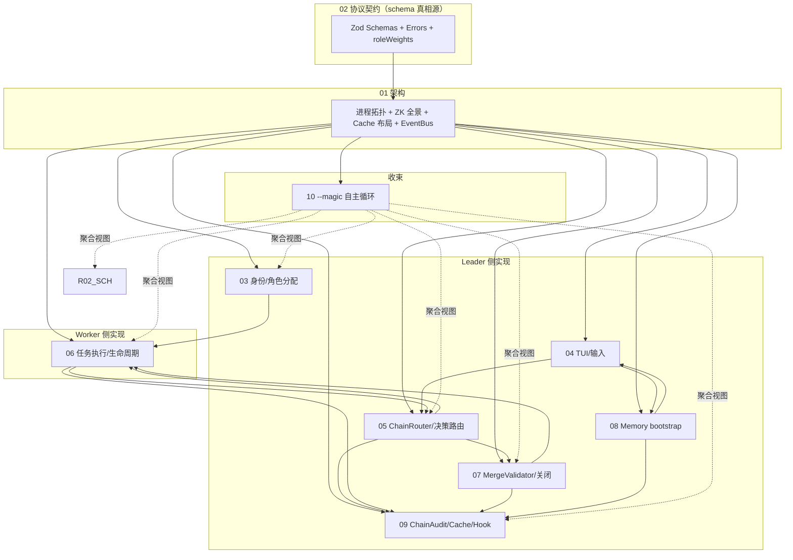

# Detailed Design — Claude Orchestrator v0.7

## 1. 文档定位

本目录是 Claude Orchestrator **v0.7 的详细设计文档（DD）**。基于 `docs/v0.7/prd/` 的 35 条功能需求与 7 项非功能约束，从 schema 真相源、进程模型、模块切分、状态机、关键算法到端到端时序，给出一份**可直接落地的实现指引**。

**重要纪律**：

- DD **不复用 v0.6 及更早版本的设计内容**；所有结构基于 v0.7 PRD 重新论证
- 每条 FR 在 DD 中指定**唯一主文件**深度展开，其它文件以 `参见 0X-xxx.md §Y` 交叉引用，禁止重复实现细节
- schema 与协议字段以 `02-contracts-and-protocol.md` 为**唯一真相源**

---

## 2. 文件清单

| 文件 | 回答的问题 |
|---|---|
| `00-README.md`（本文） | 目录索引、FR×File 矩阵、阅读路径、命名规范 |
| `01-architecture.md` | 进程拓扑、ZK 节点全景、模块切分、启动 5 阶段、Cache 目录布局、**包结构与依赖** |
| `02-contracts-and-protocol.md` | 所有 Zod schema、branded ID、14 个错误类（git 五分类）、`PROTOCOL_VERSION` 0.7.0、`roleWeights` 6×6、Decision×Link 合法性矩阵、**LinkCommitRecord / UpstreamCommits** |
| `03-identity-and-roles.md` | name pool、role 优先级填充（默认 + `--magic`）、WorktreeInitializer、身份卡三段拼接、Explorer 角色 |
| `04-tui-and-input.md` | TUI 六面板、键位、INPUT 路由、`/init` slash、`[MAGIC]` 徽标、事件颜色映射 |
| `05-chain-router-and-decisions.md` | ChainRouter 状态机、五态决策机械路由、`resolveFeedbackTarget` / `dispatchFeedbackAsRetry`、**spawn_chain 路由** |
| `06-tasks-and-workers.md` | TaskQueue.claim 排序、Worker 执行流、SelfEvaluator 三连重试、CommitChecker、跨角色协助、Recovery、子进程重启、自杀机制、**Explorer task prompt**、**pre-task rebase / 双轨 commit / DocsCommitter / git 错误五分类** |
| `07-merge-validator-and-closure.md` | MergeDecision 三态、`isCommitMerged` + `merge-base --is-ancestor`、merge_failed 终态 + accept-link Worker retry、git 错误五分类、**单次合并 accept-link 分支**、**close vs spawn 复用** |
| `08-memory-and-bootstrap.md` | MemoryBootstrap、`/init`、`memory_refresh` 增量、`refreshStale` |
| `09-audit-and-cache.md` | ChainAudit API（含 `recordLinkCommit` / `collectUpstreamCommits` / `clearLinkCommitsFrom` 三方法）、manifest 字段全表、audit.jsonl 事件类型、Cache 目录、Lifecycle hooks + `CO_*` env、TUI 渲染挂钩 |
| `10-magic-loop.md` | **收束**：`--magic` 配置传播、spawn_chain 端到端时序、Chain Forest 模型、终止条件矩阵、v0.6 与 v0.7 不兼容性 |

---

## 3. 推荐阅读路径

| 读者 | 路径 |
|---|---|
| **架构师** | 00 → 01 → 02 → 05 → 10 |
| **实现者**（按既有约束实现） | 02 → 01 → 09 → 06 → 07 → 05 → 03 → 08 → 04 → 10 |
| **增量实现者** | 10（全貌）→ 02（schema 差异）→ 05 §4.6（spawn_chain 路由）→ 03 §6（explorer 角色）→ 06 §11（Explorer task）→ 07 §7（merge 复用）→ 09 §1.3 / §4.3（manifest 与 audit 增量） |
| **验收人** | 00（FR×File 矩阵）→ 10→ 04（FR-01~04）→ 06（FR-12~14, 21~25）→ 07（FR-15~17） → 05（FR-09~11, 16, 18~20）→ 09（FR-26~27, 35）→ 08（FR-28~30）→ 03（FR-05~08, 31~32） |
| **PM / 决策者** | 00 → `docs/v0.7/prd/01-overview.md` → 10（自主循环模型） |

---

## 4. FR × File 矩阵

| FR | 标题 | 主文件 | 次文件 |
|---|---|---|---|
| **FR-01** | 一键启动 `run --worker N` | `01-architecture.md` §1 / §6 | — |
| **FR-02** | TUI 六面板 | `04-tui-and-input.md` §2 / §3 / §9 | — |
| **FR-03** | TUI 键盘交互 | `04-tui-and-input.md` §5 | `04-tui-and-input.md` §7 (Ctrl+C) |
| **FR-04** | INPUT 路由 | `04-tui-and-input.md` §6 | `05-chain-router-and-decisions.md` §3 |
| **FR-05** | 角色权重表 | `02-contracts-and-protocol.md` §4 | `03-identity-and-roles.md` §5 / `06-tasks-and-workers.md` §2 |
| **FR-06** | 名称池 + role 优先级 | `03-identity-and-roles.md` §1 / §2 | — |
| **FR-07** | Git worktree 隔离 | `03-identity-and-roles.md` §3 | `01-architecture.md` §1 |
| **FR-08** | 身份注入三段拼接 | `03-identity-and-roles.md` §4 | `02-contracts-and-protocol.md` §3 |
| **FR-09** | 五链责任链（含 magic 第 6 链） | `05-chain-router-and-decisions.md` §2 | `02-contracts-and-protocol.md` §3.1 |
| **FR-10** | EvalDecision 五态 | `02-contracts-and-protocol.md` §5 + `05-chain-router-and-decisions.md` §4 | `06-tasks-and-workers.md` §5 |
| **FR-11** | ChainDef 拆解（plan 可 null） | `02-contracts-and-protocol.md` §7 + `05-chain-router-and-decisions.md` §3 / §7 | — |
| **FR-12** | SelfEvaluator 三连重试 + format-hint | `06-tasks-and-workers.md` §5 | `02-contracts-and-protocol.md` §5 |
| **FR-13** | 自动 commit + claude 生成 message | `06-tasks-and-workers.md` §4 | — |
| **FR-14** | Lifecycle hooks | `09-audit-and-cache.md` §6 | `06-tasks-and-workers.md` §3 |
| **FR-15** | MergeValidator (merge / skip / review_first) | `07-merge-validator-and-closure.md` §2 / §3 / §6 | — |
| **FR-16** | close_chain 触发 runMergeValidation | `05-chain-router-and-decisions.md` §4.5 + `07-merge-validator-and-closure.md` §3 / §4.1 | — |
| **FR-17** | merge_failed 终态 + Executor retry | `07-merge-validator-and-closure.md` §4.2 / §5 | `05-chain-router-and-decisions.md` §4.5 |
| **FR-18** | max_total_retries 反馈硬上限 | `05-chain-router-and-decisions.md` §4.3 | `02-contracts-and-protocol.md` §6.2 / `09-audit-and-cache.md` §1.4 |
| **FR-19** | feedback target 不可解析静默丢弃 | `05-chain-router-and-decisions.md` §5 | `02-contracts-and-protocol.md` §5.3 |
| **FR-20** | chain_id 冲突拒绝 | `09-audit-and-cache.md` §1.4 / §2 | `02-contracts-and-protocol.md` §12 |
| **FR-21** | commit 失败强制 feedback | `06-tasks-and-workers.md` §4.3 | `05-chain-router-and-decisions.md` §4.3 |
| **FR-22** | SelfEvaluator 三连失败一律 reject | `06-tasks-and-workers.md` §5 | `02-contracts-and-protocol.md` §5.2 |
| **FR-23** | 孤儿任务回收 | `06-tasks-and-workers.md` §8 | — |
| **FR-24** | Worker 子进程自动重启 ≤3 | `06-tasks-and-workers.md` §9 | — |
| **FR-25** | 父进程死亡 → Worker 1Hz 自杀 | `06-tasks-and-workers.md` §7 | — |
| **FR-26** | ChainAudit | `09-audit-and-cache.md` §1 / §4 | `02-contracts-and-protocol.md` §6 / §13 |
| **FR-27** | Cache 布局 | `09-audit-and-cache.md` §5 | `01-architecture.md` §4 |
| **FR-28** | `/init` slash 触发 bootstrap | `08-memory-and-bootstrap.md` §4 | `04-tui-and-input.md` §6 |
| **FR-29** | `memory_refresh` 增量 | `08-memory-and-bootstrap.md` §5 | `06-tasks-and-workers.md` §4 |
| **FR-30** | `refreshStale` 陈旧扫描 | `08-memory-and-bootstrap.md` §6 | — |
| **FR-31** | Explorer 角色与 explore 链节 | `03-identity-and-roles.md` §6 + `06-tasks-and-workers.md` §11 | `02-contracts-and-protocol.md` §3 / §4 |
| **FR-32** | `--magic` 启动开关 | `03-identity-and-roles.md` §2.2 + `10-magic-loop.md` §1 | `04-tui-and-input.md` §8 |
| **FR-33** | `spawn_chain` 决策与链派生 | `05-chain-router-and-decisions.md` §4.6 + `10-magic-loop.md` §4 | `07-merge-validator-and-closure.md` §7 / `02-contracts-and-protocol.md` §5 |
| **FR-34** | `--magic-max-chains` 上限 | `10-magic-loop.md` §5 + `05-chain-router-and-decisions.md` §4.6 步骤 2 | `04-tui-and-input.md` §4.2 |
| **FR-35** | ChainAudit manifest 扩展 | `02-contracts-and-protocol.md` §6 + `09-audit-and-cache.md` §1.3 / §4.3 | `10-magic-loop.md` §7 |

> 矩阵不变量：35 行全部有"主文件"标记；多个文件出现的字段必然在 `02-contracts-and-protocol.md` 中有 schema 定义。

---

## 5. 模块依赖（整体视图）



---

## 6. 命名规范

| 类型 | 风格 | 示例 |
|---|---|---|
| 文件名 | `NN-kebab-case.md` | `05-chain-router-and-decisions.md` |
| Zod schema 类型 | `<PascalCase>Schema` | `EvalDecisionSchema` |
| TS 类型 | `<PascalCase>` | `ChainManifest` |
| 常量 | `UPPER_SNAKE_CASE` | `PROTOCOL_VERSION` / `CHAIN_LINKS` / `NEXT_LINKS` |
| 错误类 | `<Reason>Error` | `ChainConflictError` / `CommitFailedError` |
| 函数 | `camelCase` | `resolveFeedbackTarget` / `runMergeValidation` |
| Audit 事件 | `snake_case` | `chain_spawned` / `feedback_unresolved` |
| 配置键 | `snake_case` | `magic_mode` / `max_total_retries` |
| Mermaid 子图标签 | 中文允许，含空格用引号 | `subgraph "Leader 侧实现"` |

---

## 7. 与 PRD 的双向追溯

每个 DD 文件首段（`> PRD 锚`）标注它实现的 PRD 章节。逆向核查：

```bash
# 35 条 FR 全数被引用：
grep -rn "FR-\(0[1-9]\|[12][0-9]\|3[0-5]\)" docs/v0.7/dd/ | sort -u

# 标记完整性：
grep -rn "" docs/v0.7/dd/

# 范围隔离：以下命令应无输出（不引用旧版本设计）：
grep -rn "rc0-v0.6\|v0.6/dd\|rc1-v0.6\|v0.5/" docs/v0.7/dd/
```

> 注：v0.6 及更早版本的旧文档目录（`v0.5/` / `v0.6/` / `rc0-v0.6/` / `rc1-v0.6/`）已从仓库移除；DD 与 PRD 都不再引用旧版本设计,所有交叉引用只指向 `docs/v0.7/` 内部。

---

## 8. 验证清单（DD 完成度核查）

| 检查项 | 通过条件 |
|---|---|
| 全部 35 条 FR 在矩阵中有主文件标记 | §4 表格 35 行 |
| 5 条 FR 都有主+次文件 | FR-31..35 在 §4 中均双标 |
| schema 字段不冲突 | 02 中字段名与 03~10 中提及一致；本目录无 schema 重定义 |
| Mermaid 渲染无语法错误 | 在 GitHub / VS Code mermaid 预览器打开 01 / 05 / 06 / 07 / 10 验证 |
| 交叉引用目标存在 | `grep -rn '参见.*\.md' docs/v0.7/dd/` 列出的文件名都在本目录 |
| 不引用旧版本设计 | §7 grep 命令无输出 |
| src/ 无改动 | `git status` 末尾 `src/` clean |

---

## 9. 不在 DD 中的内容

- **代码实现**：DD 仅给 schema、伪代码、状态机、时序。具体 TS 实现留给后续 PR。
- **测试用例**：单元/集成测试设计在 v0.7 DD 范围之外；候选独立目录 `docs/v0.7/test-plan/`。
- **验收 checklist**：v0.7 不再维护独立 acceptance-checklist 文档（旧 RC0 版本已随 `rc0-v0.6/` 目录移除）。验收以 PRD `04-functional-requirements.md` 每条 FR 末尾的"done 判定"为准, 验收项已嵌入对应 FR 的判定列。
- **运维手册**：备份、监控、容量规划等不在 v0.7 DD 范围。
