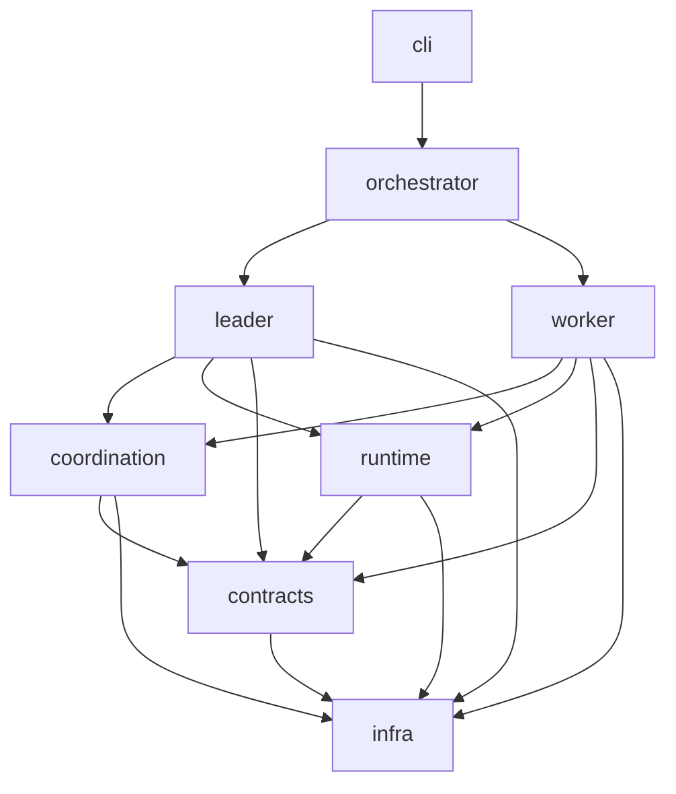

# 01 — 系统���进程模�

> **DD 定�**：v0.7 的进程拓扑�模�切分�ZK 节点全景�Cache 目录布局��动时�。本文�答"系统由什么组���调��状�存在哪里"。
>
> **PRD 锚**：`docs/v0.7/prd/01-overview.md` §4.2 零中心化；`docs/v0.7/prd/04-functional-requirements.md` FR-01 / FR-07 / FR-23~25 / FR-32（`--magic` �动）；`docs/v0.7/prd/05-non-functional.md` §1 / §4.
>
> **�赖**：所有 schema �字段�以 `02-contracts-and-protocol.md` 为准。

---

## 1. 进程拓扑

```mermaid
graph TD
  subgraph User["�作员（人）"]
    OP[(键盘 TUI)]
  end

  subgraph Host["��主机（无 HTTP / 无 MCP Server）"]
    L["<b>Leader 进程</b><br/>claude-orchestrator run<br/>TUI + ZK 客户端"]
    W1["Worker �进程 #1<br/>name=Tom role=planner"]
    W2["Worker �进程 #2<br/>name=Jerry role=executor"]
    Wn["Worker �进程 #N<br/>..."]
  end

  ZK[("ZooKeeper<br/>(EPHEMERAL + SEQUENTIAL)")]
  CL[("claude CLI<br/>(�进程, �次 -p 调用 fork)")]

  OP -->|stdin| L
  L -->|fork(child.js)| W1
  L -->|fork(child.js)| W2
  L -->|fork(child.js)| Wn
  L <-->|Watch / Read / Write| ZK
  W1 <-->|Watch / Read / Write| ZK
  W2 <-->|Watch / Read / Write| ZK
  Wn <-->|Watch / Read / Write| ZK
  L -.->|claude -p（decompose, merge-decision）| CL
  W1 -.->|claude -p（task + self-eval）| CL
  W2 -.->|claude -p（task + self-eval）| CL
  Wn -.->|claude -p（task + self-eval）| CL
```

���：
1. **� Leader**：`/leader` 是 ZK EPHEMERAL 节点，互斥抢�。第二个 Leader �动� `ZK_NODE_EXISTS` 立�退出（FR-01 + 05 §1）。
2. **Worker 是 Leader fork 的�进程**，�父进程进程组管�；Ctrl+C � Leader → SIGTERM 全部 Worker；Worker 1Hz 主动�活父进程（FR-25）。
3. **跨进程通信仅� ZK**：Leader � Worker 之间�开任何 socket 或管�；唯一例外是 `fork()` 时 IPC channel 仅作为�进程�动信�，�行期��赖。
4. **claude CLI 是无状�外部�进程**：�次 `claude -p` 调用一次性 fork，结�通过 stdout �收（`execWithTee` / `execWithStreaming`）。

---

## 2. 模�切分

### 2.1 Leader �系统

| �系统 | �责 | 主文件 |
|---|---|---|
| **TUI**            | 渲染 6 �� + �收键盘输入 + 写 `user_input` Message | `04-tui-and-input.md` |
| **LeaderWatcher**  | Watch `/messages/{leader_id}/msg-*`，按 type 分�到 ChainRouter 或 MemoryBootstrap | `05-chain-router-and-decisions.md` §1 |
| **ChainRouter**    | 需求拆解（decompose）；EvalDecision 五�路由；feedback target 解�；spawn_chain 派生 | `05-chain-router-and-decisions.md` |
| **TaskOrchestrator** | Watch `/tasks/pending` � `/tasks/claimed`，�射 `task_created` / `task_claimed` / `task_completed` 事件 | `06-tasks-and-workers.md` §2 |
| **WorkerMonitor**  | Watch `/instances`，�射 `worker_joined` / `worker_left` | `06-tasks-and-workers.md` §6 |
| **Recovery**       | 孤儿任务�收 + �进程��计数 | `06-tasks-and-workers.md` §6 |
| **MergeValidator** | close_chain / spawn_chain 时把链内所有 commit merge 到 main | `07-merge-validator-and-closure.md` |
| **ChainAudit**     | manifest / audit.jsonl / requirement.md 读写；openChain / closeChain / incrementRetry | `09-audit-and-cache.md` |
| **MemoryBootstrap** | `/init` slash 触�；memory �片生�；`memory_refresh` �� | `08-memory-and-bootstrap.md` |
| **HookEngine**     | 4 类 lifecycle hook 触� + `CO_*` env 注入 | `09-audit-and-cache.md` §6 |
| **LeaderEventBus** | 类�化 EventEmitter，串�所有�系统事件 | 本文 §5 |

### 2.2 Worker �系统

| �系统 | �责 | 主文件 |
|---|---|---|
| **MessageListener** | Watch `/messages/{instance_id}/msg-*`，按 type 派� | `06-tasks-and-workers.md` §3 |
| **TaskExecutor**    | 渲染 task prompt → 调用 ClaudeRunner | `06-tasks-and-workers.md` §3 |
| **TemplateEngine**  | 加载 `worker-{role}-task.md` + 身份�三段拼� + ��替� | `03-identity-and-roles.md` §4 |
| **ClaudeRunner**    | 包装 `claude -p` �进程 (`execWithTee` / `execWithStreaming`) | `06-tasks-and-workers.md` §3 |
| **CommitChecker**   | 任务完�� `git add -A && git commit`；失败抛 CommitFailedError | `06-tasks-and-workers.md` §4 |
| **SelfEvaluator**   | 渲染 `worker-evaluate.md` 解� EvalDecision；3 次�试 + format-hint + fallback reject | `06-tasks-and-workers.md` §5 |
| **CompletionReporter** | 把 EvalDecision JSON 包装为 `completion_report` Message �� Leader | `06-tasks-and-workers.md` §3 |
| **ParentLiveness**  | 1Hz `process.kill(ppid, 0)` �活；父死自� | `06-tasks-and-workers.md` §6 |

### 2.3 Leader ↔ Worker 数��

```mermaid
sequenceDiagram
  autonumber
  participant OP as �作员
  participant TUI as Leader TUI
  participant LW as LeaderWatcher
  participant CR as ChainRouter
  participant TQ as TaskQueue（ZK /tasks）
  participant W as Worker（Tom / planner）
  participant CA as ChainAudit

  OP->>TUI: 输入需求 + Enter
  TUI->>LW: 写 /messages/{leader_id}/msg-NNNNN (type=user_input)
  LW->>CR: handleRequirement(content)
  CR->>CA: openChain(chain_id, requirement)
  CR->>CR: decompose → ChainDef
  CR->>TQ: push 5(或 6) 个 Task 到 /tasks/pending
  TQ-->>W: zk watch 触�
  W->>TQ: claim(task) → 创建 /tasks/claimed/<self>-task-NNNNN (EPHEMERAL)
  W->>W: 渲染 prompt → claude -p → CommitChecker → SelfEvaluator
  W->>LW: 写 /messages/{leader_id}/msg-MMMMM (type=completion_report, content=EvalDecision JSON)
  LW->>CR: handleCompletionReport(decision)
  CR->>TQ: push next link task / push retry task / runMergeValidation
  Note over CR,CA: closeChain / chain_spawned 等终�触��� 05 §3 � 10 §4
```



---

## 3. ZK 节点全景

### 3.1 节点树

```
/claude-orchestrator
├── leader                                  [EPHEMERAL]    01 §3.2
├── instances/
│   ├── Tom                                 [EPHEMERAL]    01 §3.2
│   ├── Jerry                               [EPHEMERAL]
│   └── ...
├── tasks/
│   ├── pending/
│   │   ├── task-00001                      [PERSISTENT_SEQUENTIAL]
│   │   ├── task-00002                      [PERSISTENT_SEQUENTIAL]
│   │   └── ...
│   ├── claimed/
│   │   ├── Tom-task-00001                  [EPHEMERAL]   � claim lock
│   │   └── ...
│   └── completed/
│       └── task-NNNNN                      [PERSISTENT]
└── messages/
    ├── <leader_id>/
    │   ├── msg-00000                       [PERSISTENT_SEQUENTIAL]
    │   └── ...
    ├── Tom/
    │   ├── msg-00000
    │   └── ...
    └── ...
```

> `protocol_version`�`magic_mode`�`magic_max_chains` 写入 `/leader` 节点 payload（详� `02-contracts-and-protocol.md` §11.1）。Worker �动时读 `/leader` 校验 PROTOCOL，并感知 magic 上下文。

### 3.2 节点语义

| 节点 | 类� | 创建者 | 删除时机 |
|---|---|---|---|
| `/leader` | EPHEMERAL | Leader �动 | Leader 进程退出 / ZK session 失效 |
| `/instances/{id}` | EPHEMERAL | Worker child-runner | Worker �进程退出 / ZK session 失效 |
| `/tasks/pending/task-NNNNN` | PERSISTENT_SEQUENTIAL | ChainRouter.push / Recovery.reclaim | 任务被 claim �由 TaskQueue 删除 |
| `/tasks/claimed/{instance_id}-task-NNNNN` | EPHEMERAL | TaskQueue.claim（atomic create） | 任务完�（move to completed） / Worker 失�（自动删） |
| `/tasks/completed/task-NNNNN` | PERSISTENT | TaskQueue.complete | 无 TTL，长跑�累积（PRD §6 已知边界） |
| `/messages/{instance_id}/msg-NNNNN` | PERSISTENT_SEQUENTIAL | ��方 | Receiver dismiss � delete |

### 3.3 关键��性

1. **Atomic claim**：Worker 调用 `zk.create('/tasks/claimed/<self>-task-NNNNN', EPHEMERAL)`，ZK ���有第一个 create �功的 Worker 拿到任务（其它 Worker 收 `NODE_EXISTS`）。详� `06-tasks-and-workers.md` §2。
2. **Atomic leader election**：Leader 抢 `/leader` 节点��。
3. **SEQUENTIAL 顺�**：消�按 ZK 内部计数器递�，跨 Watch 触��按 `msg-NNNNN` 字符串顺�处����因��。

### 3.4 ZK 容�

- �节点 payload 上� 1 MiB（ZK �生）。Task / Message JSON 通常 < 16 KiB；超 64 KiB 的 `result` �盘并以 `file://<path>` 引用（详� `09-audit-and-cache.md` §5）。
- Watch �是�久订阅：�次触��必须�新 set watch。ZK 客户端�装在 `zk/client.ts` 自动�置（PRD §1 ZK 自动��）。

### 3.5 ZkNodeSpec �案

```ts
export type ZkNodeKind =
  | 'PERSISTENT'
  | 'PERSISTENT_SEQUENTIAL'
  | 'EPHEMERAL'
  | 'EPHEMERAL_SEQUENTIAL';

export interface ZkNodeSpec<TPayload> {
  path:        string;               // � {} ��（如 '/instances/{instance_id}'）
  kind:        ZkNodeKind;
  payloadSchema: z.ZodType<TPayload>;
  createdBy:   'leader' | 'worker' | 'task-queue' | 'message-router';
}
```

> �际 schema � `02-contracts-and-protocol.md` §11。

---

## 4. Cache 目录布局

Leader �动时根� `<cache_dir>` � `<leader_id>` �造根路径，默认 `~/.claude-orchestrator/projects/<leader_id>/`。

```
~/.claude-orchestrator/projects/<leader_id>/
├── chains/
│   └── <chain_id>/
│       ├── manifest.json              # 完整 ChainManifest（02 §6）
│       ├── audit.jsonl                # 一行一 AuditEvent（02 §13）
│       └── requirement.md             # 用户�始需求文本
├── tasks/
│   └── <task_id>/
│       ├── result.md                  # 任务产出（chain 内共享）
│       ├── exec-<ts>.log              # claude -p 执行日志
│       └── eval-<N>.log               # SelfEvaluator 第 N 次�试日志（N=1..3）
├── merges/
│   └── merge-<ts>.log                 # MergeValidator �次决策的完整日志
├── docs/
│   └── <worker_name>/
│       └── <YYYY-MM-DD>/
│           └── <prefix>-<chain_id>.md # Worker 个人备份（�� result.md 冲�）
└── memory/
    ├── CLAUDE.md                      # 顶层 memory 索引（FR-28）
    └── packages/
        └── <path>.md                  # �文件 memory �片（front-matter � source_hash）
```

> �路径的写入 owner �文件生命周期详� `09-audit-and-cache.md` §5 � `08-memory-and-bootstrap.md` §3。

---

## 5. Leader 事件总线（LeaderEventBus）

Leader 所有�系统通过类�化 EventEmitter 通信，��直�相互�赖：

```ts
export type LeaderEventMap = {
  // —— 进程
  worker_joined:      { instance_id: InstanceId; name: string; role: WorkerRole };
  worker_left:        { instance_id: InstanceId; reason: string };
  worker_restarted:   { instance_id: InstanceId; restart_count: number };

  // —— 任务
  task_created:       { task: Task };
  task_claimed:       { task_id: TaskId; claimed_by: InstanceId };
  task_completed:     { task_id: TaskId; decision: EvalDecision };
  task_recovered:     { task_id: TaskId; retry_count: number };
  task_failed:        { task_id: TaskId; reason: string };

  // —— 链
  chain_opened:       { chain_id: ChainId; magic_mode: boolean; chain_depth: number };
  chain_closed:       { chain_id: ChainId; status: ChainStatus };
  chain_merge_failed: { chain_id: ChainId; failures: ChainManifest['merge_failures'] };
  chain_spawned:      { parent: ChainId; child: ChainId };   //
  magic_depth_exhausted: { chain_id: ChainId; max_chains: number }; //

  // —— 调试
  debug_info:         { message: string; payload?: unknown };
};
```

> 渲染策略详� `04-tui-and-input.md` §4（EVENT LOG 100 �滚动 + 红字�色规则）。

---

## 6. �动 5 阶段（FR-01）

```mermaid
sequenceDiagram
  autonumber
  participant OP as �作员
  participant CLI as claude-orchestrator run
  participant IC as InitChecker
  participant WI as WorktreeInitializer
  participant L as Leader
  participant ZK as ZooKeeper
  participant WC as Worker children

  OP->>CLI: run --worker N [--magic [--magic-max-chains M]]
  CLI->>IC: validate(N>=6, claude-cli �用, ZK ���)
  IC-->>CLI: ok
  CLI->>WI: initialize(N, magicMode)
  WI->>WI: 按优先级填充 role；创建 worktree �分支；写 config.json
  WI-->>CLI: { worktree map, instance_ids }
  CLI->>L: start(leader_id, magicMode, magicMaxChains)
  L->>ZK: create /leader EPHEMERAL（� protocol_version=0.7.0, magic_mode）
  L->>L: �动 TUI�LeaderWatcher�TaskOrchestrator�WorkerMonitor�Recovery�ChainAudit�MemoryBootstrap�HookEngine
  L->>WC: fork(child.js × N, env={instance_id, name, role, worktree, ...})
  WC->>ZK: 校验 /leader.protocol_version；create /instances/{id} EPHEMERAL
  WC->>ZK: setWatch /messages/{id}
  WC-->>L: ready（通过 worker_joined 事件）
  L-->>OP: TUI 渲染完�（5 阶段结�）
```



> 5 阶段：(1) �境自检；(2) Worktree �始化；(3) Leader �动 + TUI；(4) Worker fork；(5) 等待事件。
>
> `--magic` 时 (2) 阶段的 role 填充顺��为 `planner > executor > verifier > reviewer > accepter > explorer`（详� `03-identity-and-roles.md` §2.2）；(3) 阶段 `/leader.magic_mode=true`；(4) 阶段所有 Worker 在校验 protocol 之外�外读� `magic_mode` 用�决定是��用 spawn_chain 决策�法性。

---

## 7. 关�（Ctrl+C / Leader 崩溃）

| 触� | 行为 |
|---|---|
| **Ctrl+C** in TUI | TUI �� SIGINT → emit `shutdown_requested` → LeaderEventBus 通知所有�系统 → SIGTERM �进程 → 等 5s grace → SIGKILL；最� `zk.close()` 主动释放 `/leader` |
| **Leader 崩溃** | Worker 1Hz �活 ppid 检测父死 → �进程立� `process.exit(1)` → `/instances/*` EPHEMERAL 节点自动消失（FR-25） |
| **Worker 崩溃** | 父进程 `child.on('exit')` → restart_count++；≤3 次内 refork；> 3 次 emit `worker_left` 永久下线（FR-24） |
| **ZK 断�** | ZkClient 指数退��� 10 次；超�进程退出（PRD §1） |

> Leader ��热备；崩溃��作员需手动 `run --worker N`（PRD §6 已知边界 - � Leader�无热备）。

---

## 8. �置层�（PRD §5 §6 �置四级�并）

```
CLI �数 / �境��
        > Worktree �置（.claude-orchestrator/worktree/<name>/config.json，�选）
            > 项目根�置（.claude-orchestrator/config.json）
                > 全局�置（~/.claude-orchestrator/config.json）
                    > 内置默认值
```

关键键：

| 键 | 默认 | 覆写方� |
|---|---|---|
| `zookeeper.hosts` | `127.0.0.1:2181` | CLI `-z` / env `ZK_HOSTS` / 全局 |
| `zookeeper.root_path` | `/claude-orchestrator` | 全局 |
| `cache_dir` | `~/.claude-orchestrator` | 全局 |
| `commands.claude-cli` | `claude --dangerously-skip-permissions --permission-mode dontAsk` | 全局 |
| `commands.git` | `git` | 全局 |
| `hooks.worker_message_start` 等 | `null` | 全局 |
| `--worker N` | `6`(最� 6) | CLI |
| `max_total_retries` (`CO_CHAIN_MAX_RETRIES`) | `9` | env |
| **`git.merge_target_branch`** | `null`（�退到 Leader HEAD） | 全局 / 项目 |
| **`git.remote`** | `"origin"`（`null` 关闭 fetch / pre-task remote �步） | 全局 / 项目 |
| **`git.auto_commit_init_files`** | `true` | 全局 / 项目 |
| **`git.auto_commit_init_files_branch`** | `null`（��起分支） | 全局 / 项目 |
| **`worktree.reset_on_reuse`** | `true`（worktree �用时 `git reset --hard <leader_head>`） | orchestrator 内部�数（�用户�置层；详� `06-tasks-and-workers.md` §1） |
| **`--magic`** | å…³ | CLI |
| **`--magic-max-chains M`** | unlimited | CLI / env `CO_MAGIC_MAX_CHAINS` |

> **rc1 worktree 工作�相关键**：
> - `git.merge_target_branch=null` 时 MergeValidator 在 `validate()` �场 `git rev-parse --abbrev-ref HEAD` � Leader 进程当�分支；显�设 `"main"` 适用�"在 feature 分支�动 orchestrator 但��并� main"的工作�。
> - `git.remote=null` 既� MergeValidator 的 `git fetch <remote> <main>` 也� Worker pre-task rebase 的 `git fetch <remote> <sha>`；适�无远程仓 / 离线开�。
> - `worktree.reset_on_reuse` 在 orchestrator �用既存 worktree 时执行 `git reset --hard <leader_head>`：**有�清�**，丢弃 worktree 中未 commit 的工作。代�归�：`packages/orchestrator/src/worktree-initializer.ts:166`。
>
> 详� `10-magic-loop.md` §1（magic �置传播）；`06-tasks-and-workers.md` §3.5（pre-task rebase）；`07-merge-validator-and-closure.md` §3.2 / §6.5（merge target / remote 应用�`isCommitMerged`）；代� `packages/orchestrator/src/worktree-initializer.ts:166`（worktree �用 + `reset_on_reuse`）。

---

## 9. 模��赖图

```mermaid
graph LR
  subgraph Contracts["02 �议契约（schema 真相�）"]
    SCH[Zod Schemas + Errors + roleWeights]
  end

  subgraph LeaderSide["Leader 侧"]
    TUI[04 TUI]
    LW[05 ChainRouter / LeaderWatcher]
    CA[09 ChainAudit]
    MV[07 MergeValidator]
    MB[08 MemoryBootstrap]
    TQ[06 TaskOrchestrator]
    REC[06 Recovery]
    MON[06 WorkerMonitor]
    HE[09 HookEngine]
    EB[01 §5 EventBus]
  end

  subgraph WorkerSide["Worker 侧"]
    ML[06 MessageListener]
    TE[06 TaskExecutor + TemplateEngine]
    CR_W[06 ClaudeRunner]
    CC[06 CommitChecker]
    SE[06 SelfEvaluator]
    PL[06 ParentLiveness]
  end

  SCH --> TUI & LW & CA & MV & MB & TQ & REC & MON & HE
  SCH --> ML & TE & CR_W & CC & SE
  LW --> CA & MV & TQ & EB
  TUI --> EB
  TQ --> EB
  MON --> EB
  REC --> TQ
  ML --> TE --> CR_W
  CR_W --> CC --> SE
  SE -.->|completion_report| LW
  MB --> CA
  HE -.->|task_claimed / task_completed| EB
```



> 箭头方� = 调用 / 写入 / 派��赖。EventBus 是 Leader 内的 fan-out 中�；跨进程通信仅通过 ZK（图中以虚线表示 ZK 中转）。

---

## 10. �其它 DD 的交�引用入�

| 主题 | 主文件 |
|---|---|
| schema 完整定义 | `02-contracts-and-protocol.md` |
| 角色/身份/worktree 分� | `03-identity-and-roles.md` |
| TUI 渲染�键盘 | `04-tui-and-input.md` |
| EvalDecision 路由细节 | `05-chain-router-and-decisions.md` |
| Worker 执行���� | `06-tasks-and-workers.md` |
| Merge �链关闭 | `07-merge-validator-and-closure.md` |
| Memory bootstrap | `08-memory-and-bootstrap.md` |
| ChainAudit / Cache / Hook | `09-audit-and-cache.md` |
| `--magic` 端到端 | `10-magic-loop.md` |

---

## 11. 包结���赖（monorepo 物�布局）

代�组织为 8 个 npm 包，按�赖���动：

```
packages/
├── infra/           # 基础设施层：zk client, fs paths, logger, config-loader
├── contracts/       # �议契约层：所有 Zod schemas�错误类�enum���（IClaudeRunner / IEventBus / ...）
├── runtime/         # �行时层：ClaudeRunner�TemplateEngine�HookEngine（执行 + 渲染 + hook）
├── coordination/    # �调层：TaskQueue�MessageRouter�Registry（基� zk client 包装的高级�语）
├── leader/          # Leader 侧业务：ChainAudit�ChainRouter�MergeValidator�WorkerMonitor�Recovery�TUI 状�机
├── worker/          # Worker 侧业务：Watcher�CommitChecker�DocsCommitter�SelfEvaluator�ParentLiveness
├── orchestrator/    # 进程编�：5-phase �动�worktree-initializer�fork �进程
└── cli/             # 用户入�：commander 命令注册��数解�
```

### 11.1 �赖���（7 层）



> **���**：
> - **零循��赖**：上层�赖下层，�之��许。`contracts` 仅�赖 `infra`（类� / logger ��），��赖任何业务包。
> - **跨 Leader/Worker 共享**：所有跨进程�议（schemas / errors / enums / ��）�放 `contracts`；`leader` � `worker` 互��赖。
> - **`runtime` �感知 ZK**：ClaudeRunner / TemplateEngine / HookEngine 是纯执行层，�直�调用 zk client；coordination 层负责 ZK 桥�。

### 11.2 � v0.6 的差异

- v0.6 ä»… 7 个包（`worker` 拆出 `coordination` 是 ¼ŒæŠŠ"Worker ä¸� ZK 的消æ�¯è¯»å†™"ä»� worker 业务剥离）。
- `contracts` 在 � `LinkCommitRecord` / `UpstreamCommitsSchema` / 4 个 git 错误类 / `MagicDepthExhaustedError`（详� `02-contracts-and-protocol.md` §6.0 / §9 / §12）。
- `worker` 在 � `DocsCommitter` �模�（�轨 commit，详� `06-tasks-and-workers.md` §4.5）。
