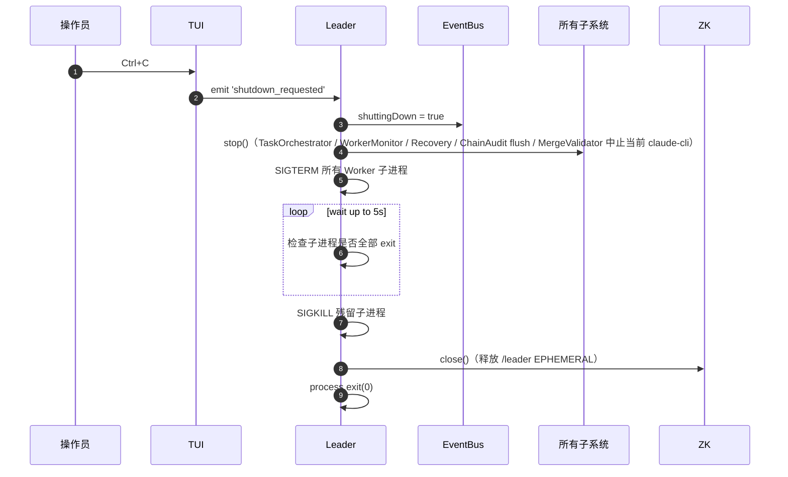

# 04 — TUI 与用户输入

> **DD 定位**：TUI 六面板组件树与渲染节流；键盘交互完整映射；INPUT 框 → ZK message 路由；`/init` slash 解析；**[v0.7 NEW]** `[MAGIC]` 标题徽标与 magic 事件渲染。
>
> **PRD 锚**：FR-02 / FR-03 / FR-04 / FR-28（/init 入口）/ FR-32（MAGIC 徽标）/ FR-34（降级提示）。
>
> **Schema**：与 `02-contracts-and-protocol.md` §9 (Message)、`01-architecture.md` §5 (LeaderEventBus) 协同。

---

## 1. 渲染技术栈

- 纯 ANSI escape 渲染（无第三方 TUI 库 ink/blessed）
- 由 `LeaderTui` 类管理：监听 `LeaderState.on('changed')` 并整屏重绘
- `LeaderState` 在每个 LeaderEventBus 事件触发后调用 `.apply(event)` 更新内部 state
- 输入由 `raw mode stdin` 直接读取按键流

不变量：
- TUI 在 Leader 主进程内，与所有子系统共享内存
- 不阻塞主事件循环（重绘 < 16ms 目标，无强约束）
- 终端尺寸变化（SIGWINCH）触发整屏重算

---

## 2. 六面板布局

```
┌────────────────────────────────────────────────────────────────────────────────────┐
│ Claude Orchestrator v0.7.0  [MAGIC]  chain-depth=2  Leader=leader-xxx  Workers=6   │  ← 标题栏
├──────────────────────────────────────┬─────────────────────────────────────────────┤
│  TEAM                                │  WORKER MESSAGES (focus: Tom / planner)     │
│  1. Tom    planner   Idle            │                                             │
│  2. Jerry  executor  task-00012      │  [10:23:45] plan: Started for chain-1747...│
│  3. Lucy   verifier  Executor ◀←     │  [10:23:50] Drafting blueprint...           │
│  4. Thomas reviewer  Idle            │  [10:24:11] Plan complete; awaiting eval.   │
│  5. Jack   accepter  task-00015      │                                             │
│  6. Lisa   explorer  Idle            │                                             │
├──────────────────────────────────────┼─────────────────────────────────────────────┤
│  PENDING            (2)              │  EVENT LOG (last 100)                       │
│  task-00018 verify  chain-1747...    │  10:23:40 chain-1747... opened (depth=2)    │
│  task-00019 explore chain-1747...    │  10:23:45 task_dispatch task-00012 → Jerry  │
│                                      │  10:24:11 task_completed task-00012 decision│
├──────────────────────────────────────┤  10:24:15 chain_spawned chain-A → chain-B   │
│  IN PROGRESS       (2)               │  ...                                        │
│  task-00012 execute chain-1747...    │                                             │
│  task-00015 accept  chain-1747...    │                                             │
├──────────────────────────────────────┴─────────────────────────────────────────────┤
│  INPUT: 实现一个登录页_                                                            │  ← 输入框
└────────────────────────────────────────────────────────────────────────────────────┘
```

| 面板 | 数据源 | 刷新触发 |
|---|---|---|
| **标题栏** | LeaderState.config + state.activeChainDepth | config 启动时设；activeChainDepth 跟随 chain_opened/closed 更新 |
| **TEAM** | state.workers | worker_joined / worker_left / worker_restarted / task_claimed / task_completed |
| **WORKER MESSAGES** | 当前 focus 的 worker 的最近消息行 | StreamTailer 从 `tasks/<task_id>/exec-*.log` 读尾 |
| **PENDING** | state.pendingTasks | task_created / task_claimed（移出 pending） |
| **IN PROGRESS** | state.inProgressTasks | task_claimed / task_completed |
| **EVENT LOG** | state.eventLog（最近 100 行） | 每个 LeaderEventBus 事件追加一行；FIFO 滚动 |
| **INPUT** | 键盘 raw input buffer | 每次按键即时刷新当前行 |

### 2.1 焦点（focus）

只有 **WORKER MESSAGES** 面板有"焦点"概念 —— Tab / Shift+Tab / 1-9 切换显示哪个 Worker 的消息流。其它面板始终全局视图。

---

## 3. TEAM 面板渲染细节

### 3.1 列定义

| 列 | 来源 | 备注 |
|---|---|---|
| `#` | 1-based index | 用于 1-9 键直跳 |
| `Name` | worker.name | NAME_POOL 中的字符串 |
| `Role` | worker.role | planner / executor / verifier / reviewer / accepter / **explorer** [v0.7 NEW] |
| `Current` | worker.currentTask?.task_id ?? 'Idle' | 跨角色协助时附 `Executor ◀←` 标记 |

### 3.2 `Executor ◀←` 跨角色标记（PRD 02 §4.2）

```text
判定：roleWeights[worker.role][task.link] != 100
渲染：currentTaskLabel + ' ' + LINK_ROLE_DISPLAY_NAME[task.link] + ' ◀←'
```

| task.link | LINK_ROLE_DISPLAY_NAME |
|---|---|
| plan | Planner |
| execute | Executor |
| verify | Verifier |
| review | Reviewer |
| accept | Accepter |
| **explore** | Explorer |

> 例：verifier `Lucy` 兜底认领 execute 任务 → TEAM 行 `3. Lucy verifier task-00018 Executor ◀←`

### 3.3 7+ Worker 的换行

TEAM 面板高度自适应 worker 数；> 12 时启用滚动（v0.7 不必，最大典型部署 8）。

---

## 4. EVENT LOG 渲染与颜色

### 4.1 100 条滚动

```text
LeaderState.appendEventLog(line, color):
  state.eventLog.push({ ts: now(), line, color })
  if state.eventLog.length > 100:
    state.eventLog.shift()
  emit 'changed'
```

### 4.2 事件 → 行映射

详见 `09-audit-and-cache.md` §7（同一映射表）。本文聚焦 v0.7 NEW 项：

| 事件 | 渲染行 | 颜色 |
|---|---|---|
| `chain_spawned` | `chain_spawned <parent> → <child>` | 青（cyan） |
| `magic_depth_exhausted` | `[debug] magic loop depth N reached: spawn_chain demoted to close_chain` | 黄（yellow） |
| `chain_merge_failed` | `MERGE_FAILED chain <id>: N branch(es)` | 红（bold red） |
| `feedback_unresolved` | `feedback for chain <id>/<link> dropped: no resolvable target` | 灰（dim） |
| `chain_id_conflict` (via debug_info) | `chain <id> already <status>; new requirement dropped` | 灰 |
| `invalid_decision` | `invalid decision <d> on link <l>; chain aborted` | 红 |

### 4.3 ANSI 序列

```ts
const COLOR = {
  reset:  '\x1b[0m',
  red:    '\x1b[31m',
  green:  '\x1b[32m',
  yellow: '\x1b[33m',
  blue:   '\x1b[34m',
  cyan:   '\x1b[36m',
  dim:    '\x1b[2m',
  bold:   '\x1b[1m',
};
```

---

## 5. 键位映射（FR-03）

| 键 | 行为 |
|---|---|
| `Tab` | WORKER MESSAGES 焦点切下一个 Worker（环回） |
| `Shift+Tab` | 焦点切上一个 |
| `1` .. `9` | 直跳到第 N 个 Worker（1-based；>workerCount 时无效） |
| 任意可打印字符 | 追加到 INPUT 缓冲 |
| `Backspace` | INPUT 退一字符 |
| `Enter` | 提交 INPUT 缓冲为 user_input message；清空 INPUT |
| `Esc` | 清空 INPUT 缓冲 |
| `?` | 切换帮助面板（v0.7 简易：临时弹一个 overlay 列出键位） |
| `Ctrl+C` | 触发 graceful shutdown（详见 §7） |

### 5.1 焦点切换实现

```text
onKey(key):
  if key == TAB:
    state.focusIndex = (state.focusIndex + 1) % state.workers.length
  if key == SHIFT_TAB:
    state.focusIndex = (state.focusIndex - 1 + state.workers.length) % state.workers.length
  if key in ['1'..'9']:
    idx = parseInt(key) - 1
    if idx < state.workers.length: state.focusIndex = idx
  emit 'changed'
```

### 5.2 输入响应

`process.stdin.setRawMode(true)` + `process.stdin.on('data', buf => ...)`：每次按键即时处理，不等行结束。

---

## 6. INPUT → ZK 路由（FR-04）

### 6.1 提交流程

```mermaid
sequenceDiagram
  autonumber
  participant OP as 操作员
  participant TUI as TUI
  participant ZK as ZK /messages/{leader_id}
  participant LW as LeaderWatcher
  participant CR as ChainRouter
  participant MB as MemoryBootstrap

  OP->>TUI: 输入文本 + Enter
  TUI->>TUI: content = inputBuffer; inputBuffer = ''
  alt content.startsWith('/')
    TUI->>TUI: 解析 slash 命令
    alt content == '/init'
      TUI->>ZK: write msg { type: 'user_input', content: '/init' }
      ZK-->>LW: watch fired
      LW->>LW: 检测 content 是 slash
      LW->>MB: bootstrap()
    else 未知 slash
      TUI->>TUI: EVENT LOG 渲染 '[debug] unknown slash command'（不写 ZK）
    end
  else 普通需求
    TUI->>ZK: write msg { type: 'user_input', content: <text> }
    ZK-->>LW: watch fired
    LW->>CR: handleRequirement(content)
  end
```

### 6.2 Message payload

```json
{
  "message_id": "msg-00042",
  "type":       "user_input",
  "from":       "<leader_id>",
  "to":         "<leader_id>",
  "content":    "实现一个登录页",
  "created_at": "2026-05-18T05:08:00.123Z"
}
```

> spawn_chain 派生的 user_input 由 ChainRouter（非 TUI）写入，并附 `spawned_from` 字段（详见 `05-chain-router-and-decisions.md` §4.6）。

---

## 7. Ctrl+C 关停时序



> Worker 收 SIGTERM → 关 ZK session → `/instances/<id>` EPHEMERAL 自动删 → claimed 任务被 Recovery 在下次 Leader 启动时回收（但本次 Leader 已退出，不立即处理）。

> 不变量：`/leader` EPHEMERAL 在 Leader 进程退出后总会消失（要么主动 `zk.close()`，要么 session timeout）；下次 Leader 启动可正常抢占。

---

## 8. 标题栏与 [MAGIC] 徽标（FR-32）

### 8.1 渲染

```text
title = `Claude Orchestrator v${PROTOCOL_VERSION}`
if config.magic_mode:
  title += '  [MAGIC]'                                // [v0.7 NEW]
if state.activeChainDepth != null:
  title += `  chain-depth=${state.activeChainDepth}`
title += `  Leader=${leaderShortId}  Workers=${state.workers.length}`
```

### 8.2 activeChainDepth 计算

```text
LeaderState.apply('chain_opened', e):
  state.activeChainId = e.chain_id
  state.activeChainDepth = e.chain_depth      // 顶层 = 0
LeaderState.apply('chain_closed', e):
  if state.activeChainId == e.chain_id:
    state.activeChainId = null
    state.activeChainDepth = null
LeaderState.apply('chain_spawned', e):
  // 子链 openChain 会触发 'chain_opened' 自带新 depth；这里只 EVENT LOG，不改 activeChainDepth
```

---

## 9. WORKER MESSAGES 面板（StreamTailer）

### 9.1 数据来源

| 状态 | 显示内容 |
|---|---|
| Worker idle | `<empty>` |
| Worker 在执行任务 task-X | `tasks/X/exec-<ts>.log` 文件的尾部 N 行（N 由面板高度决定） |
| Worker 在自评估 | `tasks/X/eval-1.log`（最新一次） |

### 9.2 StreamTailer 算法

```text
StreamTailer.attach(workerId, taskId):
  logPath = `<cache>/tasks/${taskId}/exec-<latest_ts>.log`
  fd = fs.openSync(logPath, 'r')
  state.streamTailer[workerId] = { fd, offset: 0 }
  // 250ms 定时 poll
  setInterval(() => {
    chunk = fs.readSync(fd, ...)
    if chunk.length > 0:
      appendToWorkerMessagesBuffer(workerId, chunk)
      emit 'changed' (debounced 50ms)
  }, 250)
```

> v0.7 用 poll 而非 watch（节约 inotify 资源；250ms 延迟对 TUI 体验足够）。

---

## 10. 帮助面板（`?` 键）

简易实现：覆盖 TUI 中间区域显示静态文本：

```
─── HELP ───────────────────────────────────────────────
Tab / Shift+Tab  Switch focused worker
1..9             Jump to worker N
Enter            Submit input
Esc              Clear input
?                Toggle this help
Ctrl+C           Shutdown all workers

Slash commands:
  /init          Bootstrap project memory (FR-28)

Press any key to dismiss.
─────────────────────────────────────────────────────────
```

按任意键关闭。

---

## 11. 与其它 DD 文件交叉

| 主题 | 主文件 |
|---|---|
| Message schema (type='user_input') | `02-contracts-and-protocol.md` §9 |
| LeaderWatcher 消息派发 | `05-chain-router-and-decisions.md` §1 |
| MemoryBootstrap.bootstrap | `08-memory-and-bootstrap.md` §4 |
| LeaderEventBus 事件清单 | `01-architecture.md` §5 |
| 事件 → 渲染映射主表 | `09-audit-and-cache.md` §7 |
| roleWeights 用于 `Executor ◀←` 判定 | `03-identity-and-roles.md` §5 |
| Ctrl+C 关停的 Worker 侧响应 | `06-tasks-and-workers.md` §10 |
