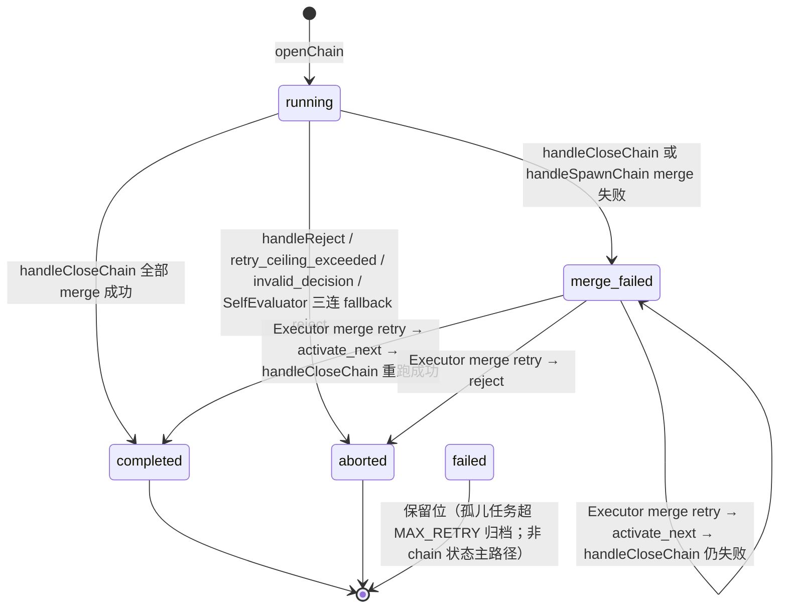
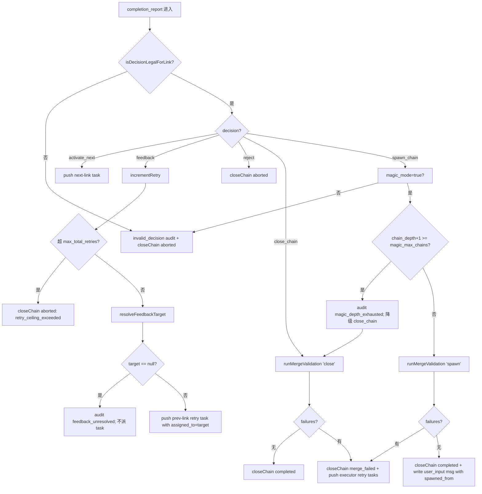

# 05 — 链路推进与 EvalDecision 路由（核心）

> **DD 定位**：ChainRouter 的状态机、NEXT_LINKS / PREV_LINKS 双端常量、EvalDecision 五态机械路由、`resolveFeedbackTarget` 算法、`dispatchFeedbackAsRetry` + retry 计数、ChainDef 拆解（plan 可 null + `--magic` 追加 explore）、 `spawn_chain` 分支、`invalid_decision` 兜底。
>
> **PRD 锚**：FR-09 / FR-10 / FR-11 / FR-16 / FR-18 / FR-19 / FR-20 / FR-33。
>
> **Schema**：`02-contracts-and-protocol.md` §3 (Link 常量) / §5 (EvalDecision) / §6 (ChainManifest) / §7 (ChainDef)。

---

## 1. ChainRouter 边界

```mermaid
graph LR
  subgraph LeaderWatcher
    LW[/messages/{leader_id} watcher/]
  end

  subgraph ChainRouter
    HR[handleRequirement]
    HCR[handleCompletionReport]
    DCT[dispatchChainTasks]
    DFB[dispatchFeedbackAsRetry]
    RFT[resolveFeedbackTarget]
    DEC[decompose 调用]
    SPC[spawnChain 分支]
  end

  CA[ChainAudit]
  TQ[TaskQueue]
  MV[MergeValidator]
  ZK[(ZK /messages/{leader_id})]

  LW -->|user_input| HR
  LW -->|completion_report| HCR
  LW -->|memory_refresh| MemBoot
  HR --> DEC
  HR --> CA
  HR --> DCT --> TQ
  HCR --> RFT --> DFB --> TQ
  HCR -->|close_chain| MV
  HCR -->|spawn_chain| SPC --> MV
  SPC --> ZK
  HCR --> CA
```

> ChainRouter 是纯 TS 路由逻辑（不调 claude-cli，除 decompose 模板调用外）。MergeValidator / ChainAudit / TaskQueue / decompose claude-cli 是它的下游依赖。

---

## 2. NEXT_LINKS / PREV_LINKS 双端一致性

PRD FR-09 要求"NEXT_LINKS / PREV_LINKS 与 CHAIN_LINKS 在 Leader 与 Worker 两处同步定义"。

| 文件 | 出现位置 |
|---|---|
| Leader 侧 | `ChainRouter` 直接 import `@co/contracts` 的常量 |
| Worker 侧 | `SelfEvaluator` 在 `isDecisionLegalForLink` 中 import 同一常量 |

> 唯一定义在 `@co/contracts/links.ts`（详见 `02-contracts-and-protocol.md` §3.1）。其它文件禁止本地重复定义。

### 2.1 accept 的 NEXT_LINKS 二义性

| `magic_mode` | accept 的 NEXT_LINKS | accept 合法 EvalDecision |
|---|---|---|
| `false`（默认） | 不使用（accept 终态） | `close_chain` / `reject` / `feedback` |
| `true`（`--magic`） | `explore` | `activate_next` / `close_chain`(罕见) / `reject` / `feedback` |

> 详见 `02-contracts-and-protocol.md` §5.2 矩阵。ChainRouter 在分发前调 `isDecisionLegalForLink(decision, link, manifest.magic_mode)` 二次校验。

---

## 3. handleRequirement（需求 → ChainDef → push tasks）

### 3.1 入口

| 来源 | content / 元字段 |
|---|---|
| **TUI 输入** | content = 用户原文；无 chain_id 字段（ChainRouter 自动生成） |
| **spawn_chain 派生** | content = Explorer 的 `next_requirement`；含 `spawned_from = <parent_chain_id>`；无 chain_id（仍由 ChainRouter 生成新 ID） |

### 3.2 算法

```text
ChainRouter.handleRequirement(msg):
  // 1. 解析需求
  requirement = msg.content
  parentChainId = msg.spawned_from ?? null                          //
  parentDepth = parentChainId ? readManifest(parentChainId).chain_depth : -1
  magicMode = leaderConfig.magic_mode
  newDepth = parentDepth + 1

  // 2. magic_max_chains 上限检查（FR-34；spawn 入口在这里被保护）
  // 注：实际上限检查发生在 spawn_chain 决策分支（§5.1），handleRequirement 仅记录 depth

  // 3. 生成 chain_id
  chainId = `chain-${Date.now()}-${rand6()}`

  // 4. openChain（可能抛 ChainConflictError，但新 ID 几乎不会冲突）
  manifest = ChainAudit.openChain(chainId, requirement, {
    magic_mode: magicMode,
    parent_chain_id: parentChainId,
    chain_depth: newDepth,
  })

  // 5. 父链 audit 记 spawn_from（如果有）
  if parentChainId:
    ChainAudit.appendAudit('chain_spawned_from', { chain_id: chainId, detail: { parent_chain_id: parentChainId, chain_depth: newDepth } })
    ChainAudit.appendChildChain(parentChainId, chainId)
    ChainAudit.appendAudit('chain_spawned', { chain_id: parentChainId, detail: { child_chain_id: chainId } })  // 父链 audit
    emit LeaderEventBus 'chain_spawned' { parent: parentChainId, child: chainId }

  // 6. decompose（调 claude-cli）
  chainDef = decomposeRequirement(requirement, { magic_mode: magicMode, chain_id: chainId })

  // 7. ChainDef 校验
  ChainDefSchema.parse(chainDef)
  if magicMode and !chainDef.explore:    throw ValidationError("magic_mode requires explore task")
  if !magicMode and chainDef.explore:    throw ValidationError("explore task only valid in magic_mode")

  // 8. dispatch tasks
  dispatchChainTasks(chainId, chainDef)

  // 9. audit
  ChainAudit.appendAudit('requirement_received', { chain_id: chainId, detail: { requirement_length: requirement.length } })
  emit LeaderEventBus 'chain_opened' { chain_id: chainId, magic_mode: magicMode, chain_depth: newDepth }
```

### 3.3 decompose 调用

```text
decomposeRequirement(requirement, opts):
  prompt = renderTemplate('worker-decompose.md', { requirement, magic_mode: opts.magic_mode, chain_id: opts.chain_id })
  out = claude -p prompt    // Leader 直接调，无 Worker 中转
  json = extractJson(out)
  return ChainDefSchema.parse(json)
```

> 关键：decompose 由 **Leader 自处理**（PRD 01 §4 提到"无 Planner 时 Leader 自决"模型，但 v0.7 PRD 中 `worker-decompose.md` 模板已统一由 Leader 加载渲染并调用 claude-cli，不再转发给 Planner Worker）。

### 3.4 dispatchChainTasks

```text
dispatchChainTasks(chainId, def):
  links = []
  if def.plan != null: links.push('plan')
  links.push('execute', 'verify', 'review', 'accept')
  if def.explore != null: links.push('explore')        // magic_mode 必含

  // 第一个 link 立即派出，其余 link 等上一 link 完成后由 handleCompletionReport 触发
  firstLink = links[0]
  pushTask(chainId, firstLink, def[firstLink])

  ChainAudit.appendAudit('task_dispatch', { chain_id, detail: { link: firstLink } })
```

> **不变量**：v0.7 采用"单 task 在 pending"模式 —— ChainRouter 一次只 push 一个 task，下一个 link 任务由 `activate_next` 触发。
> 这避免了所有 5(6) 个 task 并发进 pending、被任意 Worker 乱序认领的混乱。
> （注：PRD FR-09 描述的 "5 个 task 入 pending" 是从外部视角看到的总数，并不强制要求一次性 push。详见 03-scenarios.md §S-02 时序图。）

---

## 4. handleCompletionReport（五态路由）

### 4.1 入口

```text
ChainRouter.handleCompletionReport(msg):
  task = readTaskByMessage(msg)
  chainId = task.chain_id
  link = task.link
  manifest = ChainAudit.readManifest(chainId)
  decision = EvalDecisionSchema.parse(JSON.parse(msg.content))

  ChainAudit.appendAudit('completion_report', { chain_id, detail: { task_id: task.task_id, link, decision: decision.decision } })

  // —— 合法性校验（防御性）
  if !isDecisionLegalForLink(decision, link, manifest.magic_mode):
    ChainAudit.appendAudit('invalid_decision', { chain_id, detail: { link, decision } })
    emit LeaderEventBus 'debug_info' { message: `invalid decision ${decision.decision} on ${link}` }
    ChainAudit.closeChain(chainId, 'aborted', { reason: 'invalid_decision' })
    return

  // —— record link worker
  ChainAudit.recordLinkWorker(chainId, link, task.claimed_by)

  // —— 五态分支
  switch decision.decision:
    case 'activate_next': handleActivateNext(chainId, link, manifest)
    case 'feedback':       handleFeedback(chainId, link, decision, manifest)
    case 'reject':         handleReject(chainId, link, decision)
    case 'close_chain':    handleCloseChain(chainId, manifest)
    case 'spawn_chain':    handleSpawnChain(chainId, decision, manifest)   //
```

### 4.2 activate_next 分支

```text
handleActivateNext(chainId, link, manifest):
  nextLink = NEXT_LINKS[link]
  if nextLink == null:    // explore 没有下一环
    throw 'should be unreachable; isDecisionLegalForLink caught'

  taskSpec = readChainDef(chainId)[nextLink]    // 从持久化 ChainDef 取规格
  pushTask(chainId, nextLink, taskSpec)
  ChainAudit.appendAudit('task_dispatch', { chain_id, detail: { link: nextLink } })
```

### 4.3 feedback 分支

```text
handleFeedback(chainId, link, decision, manifest):
  // 1. 计 retry 数（FR-18）
  newCount = ChainAudit.incrementRetry(chainId)
  if newCount > manifest.max_total_retries:
    ChainAudit.appendAudit('retry_ceiling_exceeded', { chain_id, detail: { total_retry_count: newCount, max_total_retries: manifest.max_total_retries } })
    ChainAudit.closeChain(chainId, 'aborted', { reason: 'retry_ceiling_exceeded' })
    return

  // 2. 解析目标
  target = resolveFeedbackTarget(manifest, link, decision)
  if target == null:                                            // FR-19
    ChainAudit.appendAudit('feedback_unresolved', { chain_id, detail: { link, reason: decision.reason } })
    emit LeaderEventBus 'debug_info' { message: `feedback for chain ${chainId}/${link} dropped: no resolvable target` }
    // 链状态保持 running；不 push 任何 task；操作员可看到 debug_info
    return

  // 3. 派 retry task
  prevLink = PREV_LINKS[link]                                   // 必非 null（合法性校验已保证）
  prevTaskSpec = readChainDef(chainId)[prevLink]
  retryTask = {
    ...prevTaskSpec,
    task_id:     newTaskId(),
    chain_id:    chainId,
    link:        prevLink,
    description: prevTaskSpec.description + '\n\nFeedback from ' + link + ' link:\n' + decision.reason,
    priority:    'HIGH',
    assigned_to: target,                                        // 显式指派
    status:      'pending',
    retry_count: 0,
  }
  TaskQueue.push(retryTask)
  ChainAudit.appendAudit('feedback_sent', { chain_id, detail: { from_link: link, to_link: prevLink, target_worker: target, total_retry_count: newCount } })
```

### 4.4 reject 分支

```text
handleReject(chainId, link, decision):
  ChainAudit.closeChain(chainId, 'aborted', { reason: `${link}_rejected: ${decision.reason}` })
  // chain_closed 事件由 closeChain 内 emit
```

### 4.5 close_chain 分支

```text
handleCloseChain(chainId, manifest):
  ChainAudit.appendAudit('merge_validation_started', { chain_id, detail: { link_count: countLinks(manifest) } })
  result = MergeValidator.runMergeValidation(chainId, mode='close')
  if result.failures.empty():
    ChainAudit.closeChain(chainId, 'completed')
  else:
    ChainAudit.closeChain(chainId, 'merge_failed', { failures: result.failures })
    for failure in result.failures:
      pushMergeRetryTask(chainId, failure, manifest)            // 详见 07 §4.2 / §5
```

### 4.6 spawn_chain 分支

```text
handleSpawnChain(chainId, decision, manifest):
  // 1. magic_mode 必须为 true（isDecisionLegalForLink 已校验，但二次保险）
  if !manifest.magic_mode:
    ChainAudit.appendAudit('invalid_decision', { chain_id, detail: { link: 'explore', decision: 'spawn_chain', reason: 'magic_mode is false' } })
    ChainAudit.closeChain(chainId, 'aborted', { reason: 'invalid_decision' })
    return

  // 2. magic_max_chains 上限检查（FR-34）
  // 注：leaderConfig.magic_max_chains 数据源 = /leader ZK payload.magic_max_chains（详见 02 §11.1）
  //   该字段由 orchestrator 启动时读 --magic-max-chains CLI flag / env CO_MAGIC_MAX_CHAINS 写入；运行期不可变。
  if leaderConfig.magic_max_chains != null and manifest.chain_depth + 1 >= leaderConfig.magic_max_chains:
    ChainAudit.appendAudit('magic_depth_exhausted', { chain_id, detail: { chain_depth: manifest.chain_depth, max_chains: leaderConfig.magic_max_chains } })
    emit LeaderEventBus 'magic_depth_exhausted' { chain_id, max_chains: leaderConfig.magic_max_chains }
    // 降级为 close_chain（FR-34）
    handleCloseChain(chainId, manifest)
    return

  // 3. 复用 merge validation（同 close）
  result = MergeValidator.runMergeValidation(chainId, mode='spawn')
  if !result.failures.empty():
    // merge 失败时不派生子链（PRD §6.5）；走 merge_failed 路径
    ChainAudit.closeChain(chainId, 'merge_failed', { failures: result.failures })
    for failure in result.failures:
      pushMergeRetryTask(chainId, failure, manifest)
    emit LeaderEventBus 'debug_info' { message: `spawn_chain blocked by merge_failed on chain ${chainId}` }
    return

  // 4. 关闭现链
  childCandidateId = `chain-${Date.now()}-${rand6()}`            // 先生成 ID 用于父链 closeChain extra
  ChainAudit.closeChain(chainId, 'completed', { child_chain_id: childCandidateId })

  // 5. 注入新需求消息（不直接调 handleRequirement，让 LeaderWatcher 标准路径走）
  msg = {
    message_id: newMessageId(),
    type: 'user_input',
    from: leaderId,
    to: leaderId,
    content: decision.next_requirement,
    spawned_from: chainId,                                       // 触发 handleRequirement 的 parent 解析
    next_requirement: decision.next_requirement,                 // 冗余字段，便于 audit
    created_at: now(),
  }
  zk.create('/messages/{leader_id}/msg-NNNNN', payload=msg)
  // 注：实际新 chain_id 由后续 handleRequirement 重新生成；childCandidateId 是占位（PRD 容忍这点近似）

  // [实现修正]：为保证 child_chain_id 与最终 manifest 一致，可采用以下任一方案
  //   a) 不在 closeChain 时写 child_chain_ids，改在新 chain openChain 时反写父链；
  //   b) 提前生成 childCandidateId 并强制 handleRequirement 使用它。
  // v0.7 选用 (a) —— openChain 内部已经调 appendChildChain(parent, self)，
  // 因此本步 closeChain 的 child_chain_id 字段可省略；
  // 父链 manifest.child_chain_ids 由 appendChildChain 异步追加。
```

> **实现纪律**：父链 manifest.child_chain_ids 的写入由"子链 openChain 时反向 appendChildChain"完成（见 §3.2 步骤 5），而**不**由 closeChain 的 extra 参数填充。这避免了"先 close 父链、再生成子链"的字段一致性问题。

---

## 5. resolveFeedbackTarget 算法

详见 `02-contracts-and-protocol.md` §5.3 伪代码。本文补充实现纪律：

### 5.1 三段查表

| 优先级 | 来源 | 适用场景 |
|---|---|---|
| 1 | `decision.feedback_target`（显式） | commit failed self-feedback / 其它显式跨链反馈（v0.7 不主动用） |
| 2 | `manifest.link_workers[PREV_LINKS[link]]` | 标准反馈：Verifier feedback → Executor 原始 Worker |
| 3 | `null` | plan 链节 feedback（无前置）/ link_workers[prev] 未记录（罕见） |

### 5.2 invalid_decision 兜底

`isDecisionLegalForLink` 失败的 4 种典型场景：

| link | 非法 decision | 行为 |
|---|---|---|
| plan | feedback | 静默丢 + audit `feedback_unresolved`（FR-19） |
| accept | close_chain（magic_mode=true 下罕见，但合法） | 不视作非法；走常规 close 流程 |
| accept | spawn_chain | 非法 → `invalid_decision` → 链 aborted |
| execute / verify / review | spawn_chain | 非法 → `invalid_decision` → 链 aborted（FR-33 守门） |
| explore | activate_next | 非法（explore 无下一环）→ `invalid_decision` → 链 aborted |

> 不变量：任何非法决策一律链 aborted，不容忍"接近正确"的输出。SelfEvaluator 三连重试已尽力（详见 `06-tasks-and-workers.md` §5）；ChainRouter 仅做 last-line-of-defense。

---

## 6. ChainStatus 状态机



> `merge_failed → completed` 转移由 §4.5 ChainRouter merge retry 特例分支触发（详见 `07-merge-validator-and-closure.md` §4.3）。

---

## 7. ChainDef 拆解：plan 可 null + magic 追加 explore

### 7.1 schema 见 `02-contracts-and-protocol.md` §7

### 7.2 plan=null 行为（FR-11）

- decompose 输出 `{"plan": null, "execute": {...}, ...}` 时 ChainRouter 视作"跳过 plan link"
- dispatchChainTasks 首 link 为 execute（不是 plan）
- 反馈到 plan 的所有路径变成 §5.2 中的 `feedback_unresolved`（因为 plan 无前置）—— 这与"plan 不存在"的语义一致

### 7.3 magic 模式 explore 任务（FR-32）

- decompose 模板内必须感知 `magic_mode=true` 上下文并输出 `explore` 字段
- ChainRouter.handleRequirement §3.2 步骤 7 强制校验：缺 explore → ValidationError → 整次需求 reject（不开链）
- explore 任务规格通常包含"审视 plan/execute/verify/review/accept 5 链节产出，给出下一轮需求"的指引（详见 `06-tasks-and-workers.md` §11）

---

## 8. 决策路由总览



---

## 9. 与其它 DD 文件交叉

| 主题 | 主文件 |
|---|---|
| EvalDecision schema 与合法性矩阵 | `02-contracts-and-protocol.md` §5 |
| ChainAudit / manifest / audit 事件 | `09-audit-and-cache.md` |
| TaskQueue.push / claim | `06-tasks-and-workers.md` §2 |
| MergeValidator 算法细节 | `07-merge-validator-and-closure.md` |
| spawn_chain 端到端时序 | `10-magic-loop.md` §4 |
| TUI 渲染挂钩 | `04-tui-and-input.md` §4 |
| SelfEvaluator 三连重试 | `06-tasks-and-workers.md` §5 |
