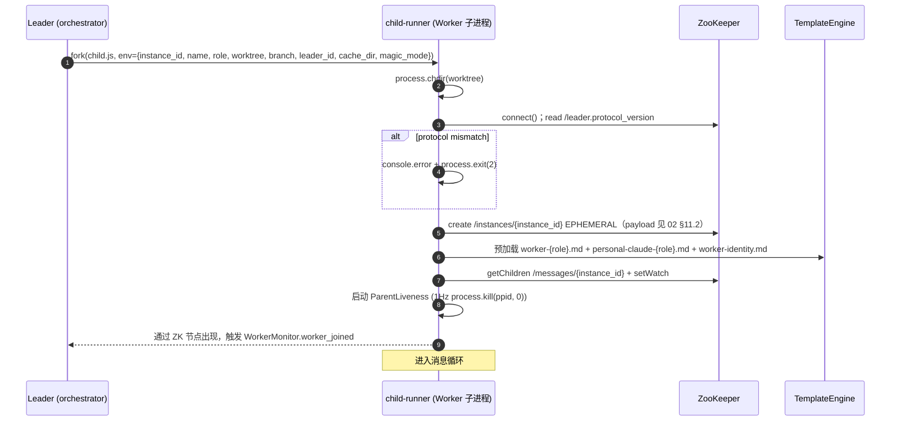
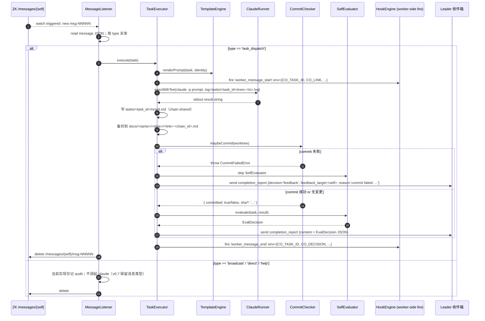
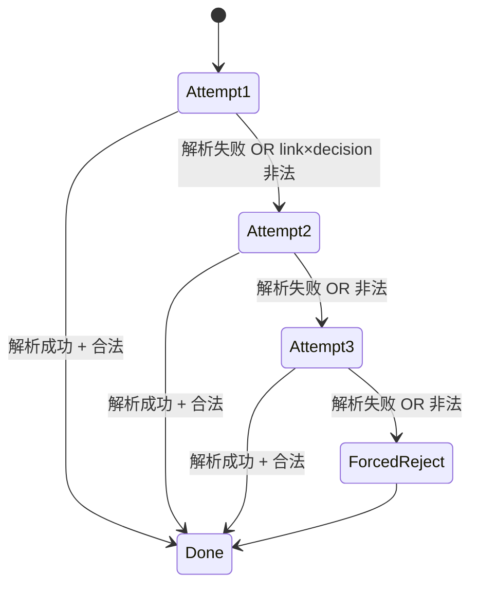
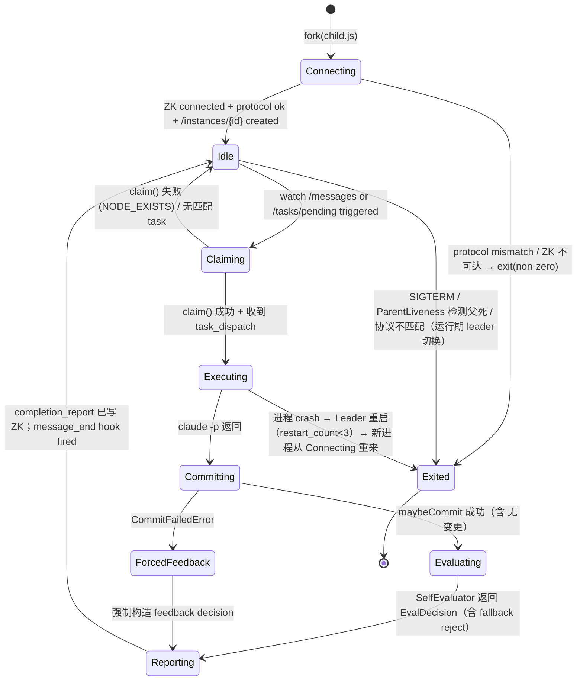

# 06 — 任务执行与 Worker 生命周期

> **DD 定位**：Worker 子进程从 fork 到关停的完整生命周期；TaskQueue.claim 排序；任务执行流（消息 → 模板 → claude → commit → 自评估 → completion_report）；SelfEvaluator 三连重试；CommitChecker 区分"无变更"与"失败"；跨角色协助；孤儿任务回收；子进程重启；父进程死亡自杀；**[v0.7 NEW]** Explorer task prompt 上下文汇编。
>
> **PRD 锚**：FR-12 / FR-13 / FR-14 / FR-21 / FR-22 / FR-23 / FR-24 / FR-25 / FR-31。
>
> **Schema**：以 `02-contracts-and-protocol.md` 为准。

---

## 1. Worker 启动序列



> child-runner 顺序：(1) chdir → (2) ZK 连接 → (3) protocol 校验 → (4) 注册实例 → (5) 预热模板 → (6) 进入 watch loop → (7) 父进程探活。任一步失败 → `process.exit(non-zero)` → 父进程 restart_count++。

---

## 2. TaskQueue.claim 排序与原子性

### 2.1 排序复合键（FR-05 / PRD 02 §4.1）

```text
TaskQueue.claim(self):
  pending = readAndWatch('/tasks/pending')           // 全部 pending tasks
  ranked = pending.sort by 复合键 desc:
    1. (task.assigned_to == self.instance_id) ? 1 : 0       // 显式指派最高优
    2. roleWeights[self.role][task.link]                    // 权重 100 / 20 / 10
    3. priorityValue(task.priority)                         // HIGH(0) < NORMAL(1) < LOW(2) → asc
    4. task.created_at / task_id                            // FIFO
  for task in ranked:
    try:
      zk.create('/tasks/claimed/<self>-<task_id>', EPHEMERAL, payload=...)
      // 成功 → 此 Worker 拿到锁
      zk.delete('/tasks/pending/<task_id>')
      return task
    catch NODE_EXISTS:
      continue   // 已被其它 Worker claim
  return null    // pending 全部尝试失败 → 等下次 watch 触发
```

### 2.2 不变量

- `assigned_to` 非 null 时仅该 Worker 排序顺位 1.0 = 1，其余 = 0 → assigned_to 永远先尝试。
- `roleWeights[self.role][task.link] == 0` 的 task（仅 `leader`，但 Worker 没有 leader role）会排到最后。
- 即便所有 task 都不偏好当前 Worker，只要权重 > 0，仍可兜底（**跨角色协助**，PRD §2.4.2）。

### 2.3 显式指派的两种用法

| 场景 | assigned_to | 来源 |
|---|---|---|
| **merge_failed retry** | manifest.link_workers[失败 link] | MergeValidator → ChainRouter（详见 `07-merge-validator-and-closure.md` §4） |
| **commit failed retry** | self (Worker 自己) | Worker.CommitChecker → 强制 feedback（本文 §4.3） |

---

## 3. 任务执行流（消息循环单次迭代）



> Hook env 完整清单见 `09-audit-and-cache.md` §6.3。

---

## 4. CommitChecker（FR-13 + FR-21）

### 4.1 maybeCommit 算法

```text
maybeCommit(worktree, task):
  cd worktree
  status = $(git status --porcelain)
  if status.empty():
    return { committed: false, sha: null }    // 无变更短路（典型：plan / verify / review / accept 不动代码）

  // 生成 commit message
  msg = renderTemplate('worker-commit-message.md', {task, identity})
  reply = claude -p msg                       // ≤72 字符；fallback 见下
  if reply 解析失败 OR reply 长度 > 72:
    reply = 'chore: auto-commit from ' + identity.name

  // 真正 commit
  run: git add -A
  run: git commit -m '<reply>'
  if exit != 0:
    throw CommitFailedError(worktree, stderr)

  return { committed: true, sha: $(git rev-parse HEAD) }
```

### 4.2 两种产出，两种处理

| 产出 | 含义 | 下一步 |
|---|---|---|
| `{ committed: false }` | 任务不修改代码（plan/verify/review/accept 常见） | 走正常 SelfEvaluator 评估 |
| `{ committed: true, sha }` | 任务产出代码并已 commit | 走正常 SelfEvaluator 评估 |
| `throw CommitFailedError` | `git commit` 真实失败（pre-commit hook 拒绝 / 无 git 配置 / 磁盘满 / ...） | **强制 feedback**，跳过 SelfEvaluator |

### 4.3 强制 feedback 构造（FR-21）

Worker 捕获 CommitFailedError 后，**不**调用 SelfEvaluator，直接构造：

```json
{
  "decision": "feedback",
  "reason": "commit failed: <stderr-1st-line>",
  "feedback_target": "<self instance_id>"
}
```

并通过 completion_report 消息发回 Leader。

不变量：
- `feedback_target = self` → ChainRouter.resolveFeedbackTarget 步骤 1 直接命中 → 派 retry 给同一 Worker
- retry task 走标准 `incrementRetry` → 计入 `total_retry_count` → 也受 `max_total_retries` 约束
- Worker 不绕过 Leader 自己重试（保证审计链完整）

### 4.4 与 SelfEvaluator 的关系

| 路径 | SelfEvaluator 是否运行 |
|---|---|
| 任务产出正常（无变更或 commit 成功） | 是 |
| CommitFailedError | 否（直接强制 feedback） |
| SelfEvaluator 自身三连失败 | 是（输出 reject，详见 §5） |

---

## 5. SelfEvaluator（FR-12 + FR-22）

### 5.1 三连重试 + format-hint

```text
SelfEvaluator.evaluate(task, taskResult):
  for attempt in [1, 2, 3]:
    prompt = renderTemplate('worker-evaluate.md', {task, result: taskResult, attempt})
    if attempt >= 2:
      prompt += renderTemplate('worker-evaluate-format-hint.md')   // 提示纠正 JSON 格式
    out = claude --fork-session -p prompt   // 每次 fork-session 消除上次锚定
    writeFile('tasks/<task_id>/eval-<attempt>.log', out)
    try:
      decision = EvalDecisionSchema.parse(extractJson(out))
      // —— Decision × Link 合法性二次校验（FR-22 关键）
      if !isDecisionLegalForLink(decision, task.link, magic_mode):
        // 例如 accept link 输出 spawn_chain / explore link 之外的任意 link 输出 spawn_chain
        // 视作"不合法解析"继续 retry
        continue
      return decision
    catch ZodError:
      continue

  // 三连失败 → 强制 reject（FR-22）
  forcedReject = {
    decision: 'reject',
    reason: `self-evaluation failed after 3 attempts (link=${task.link}) — see eval logs`,
  }
  writeFile('tasks/<task_id>/eval-fallback.json', forcedReject)
  return forcedReject
```

### 5.2 状态机



### 5.3 isDecisionLegalForLink 规则（与 `02-contracts-and-protocol.md` §5.2 矩阵一致）

```text
isDecisionLegalForLink(decision, link, magic_mode):
  if decision.decision == 'feedback' and PREV_LINKS[link] == null:
    return false                                  // plan link 不能 feedback（FR-19 静默丢路径）
  if decision.decision == 'close_chain':
    if magic_mode:
      return link in ['accept', 'explore']        // magic 模式 accept 一般 activate_next；但保留 close_chain 兼容
    else:
      return link == 'accept'
  if decision.decision == 'spawn_chain':
    return link == 'explore' and magic_mode       // FR-33
  if decision.decision == 'activate_next':
    if link == 'accept':
      return magic_mode                           // 仅 magic 模式 accept→explore 合法
    if link == 'explore':
      return false                                // explore 无下一环节
    return true
  if decision.decision == 'reject':
    return true
  return false
```

> 失败时 SelfEvaluator 把违法 decision 视作未解析继续 retry；三连仍违法 → ForcedReject。
>
> ChainRouter 收到 completion_report 后会再做一次同样的校验作为双保险（详见 `05-chain-router-and-decisions.md` §5.2 invalid_decision 路径）。

---

## 6. 跨角色协助（PRD §2.4.2）

| 触发条件 | 行为 |
|---|---|
| `/tasks/pending` 中存在 execute 任务，所有 executor 都在 claimed 状态 | 空闲的 verifier / reviewer / accepter / explorer / planner 的 watch 触发后调用 claim()；roleWeights 兜底使 verifier→execute=20 排在所有 explorer/planner（10）之上 → verifier 优先认领 |
| 兜底认领后 TEAM 面板渲染 | Current Role 列显示 `Executor ◀←`（箭头标记本次跨角色） |
| 完成后 | Worker 重新进入 idle；下一次 claim 仍按 roleWeights 优先认领自己专属 link |

> 实现要点：TaskOrchestrator 在 `task_claimed` 事件中比较 `roleWeights[claimer.role][task.link]` 是否等于 100，否 → emit `worker_role_borrowed` 事件，TUI 据此显示箭头。

---

## 7. 父进程死亡 → Worker 1Hz 自杀（FR-25）

```text
ParentLiveness.start():
  setInterval(() => {
    try:
      process.kill(process.ppid, 0)   // signal 0 = 仅探活，不真发信号
    catch ESRCH:
      // 父进程不存在
      console.error('parent process died; exiting')
      process.exit(1)
  }, 1000)
```

> 副作用：Worker 退出 → ZK session 被对方触发关闭 → `/instances/{id}` EPHEMERAL 节点消失 → `/tasks/claimed/{id}-*` EPHEMERAL 节点也消失 → Leader 的 Recovery 回收任务（详见 §8）。

---

## 8. 孤儿任务回收（Recovery，FR-23）

### 8.1 何时扫描

| 触发 | 处理 |
|---|---|
| Leader 启动完成（FR-23 中"scanOrphans()"） | 一次性扫描 `/tasks/claimed/*`，比对 `/instances/*`，缺主的全部回收 |
| `/tasks/claimed` 节点变化 watch | 检测到节点被删（owner instance 失联触发 EPHEMERAL 自动删）→ 回收对应 task |
| `worker_left` 事件（WorkerMonitor 触发） | 主动扫描该 instance 名下所有 claimed task |

### 8.2 reclaim 算法

```text
Recovery.reclaim(taskId, originalOwner, reason):
  task = readTask(taskId)
  task.retry_count += 1
  task.assigned_to = null     // 不指定，任意 Worker 可重 claim
  task.claimed_by = null

  if task.retry_count >= 3:
    moveToFailed(task)        // /tasks/completed 下 status='failed'，并写 audit task_failed
    emit LeaderEventBus 'task_failed' { task_id, retry_count }
    return

  zk.create('/tasks/pending/<task_id>', payload=task)
  emit LeaderEventBus 'task_recovered' { task_id, retry_count }
  ChainAudit.appendAudit({ event_type: 'task_recovered', chain_id: task.chain_id, detail: { task_id, retry_count, reason } })
```

### 8.3 MAX_RETRY = 3 是协议常量

PRD §1 明示 `MAX_RETRY = 3` 不开放配置（与 `max_total_retries=9` 区别：后者控制链反馈次数，前者控制单 task 孤儿重试次数）。

---

## 9. Worker 子进程重启（FR-24）

```text
Leader.spawnWorker(spec):
  child = fork('child.js', { env: ... })
  restart_count[spec.name] ??= 0
  child.on('exit', (code) => {
    if shuttingDown: return
    if code === 0: return  // 正常退出（罕见）
    restart_count[spec.name] += 1
    if restart_count[spec.name] > 3:
      emit LeaderEventBus 'worker_left' { instance_id: spec.instance_id, reason: 'restart limit exceeded' }
      return
    emit LeaderEventBus 'worker_restarted' { instance_id, restart_count: restart_count[spec.name] }
    // 复用同 name / role / worktree / instance_id 重启（保持 ZK 节点身份与 worktree 文件一致）
    Leader.spawnWorker(spec)
  })
```

> 不变量：
> - restart_count 记忆在 Leader 进程内存（Leader 自身崩溃后归零；PRD §6 边界）。
> - 重启使用相同 `instance_id` → 重新 create `/instances/<id>` EPHEMERAL → 同名 Worker 复出。
> - `restart_count > 3` 时不再 fork，发 `worker_left`；该 name 占用的 worktree 仍保留，可手工 inspect。

---

## 10. Worker 状态机（综合）



---

## 11. Explorer task prompt 上下文汇编 **[v0.7 NEW]**

Explorer 任务（仅 `--magic` 模式存在）的 prompt 必须包含足够上下文，让 Explorer 能基于"现链全貌"决定下一轮需求：

### 11.1 模板 `worker-explorer-task.md` 必含字段

| 占位符 | 来源 | 说明 |
|---|---|---|
| `{{chain_id}}` | task.chain_id | 当前链 ID |
| `{{chain_depth}}` | manifest.chain_depth | 第几代链 |
| `{{magic_max_chains}}` | Leader 启动配置 | unlimited 或具体上限（影响 Explorer 是否冒险 spawn） |
| `{{requirement_text}}` | 读 `chains/<chain_id>/requirement.md` | 本链需求原文 |
| `{{plan_result}}` | `tasks/{link_tasks.plan}/result.md` | Plan 产出（若 plan 为 null 则缺省） |
| `{{execute_result}}` | `tasks/{link_tasks.execute}/result.md` | Execute 产出 |
| `{{verify_result}}` | `tasks/{link_tasks.verify}/result.md` | Verify 产出 |
| `{{review_result}}` | `tasks/{link_tasks.review}/result.md` | Review 产出 |
| `{{accept_result}}` | `tasks/{link_tasks.accept}/result.md` | Accept 产出 |
| `{{parent_chain_summary}}` | 若 parent_chain_id != null：读父链 manifest 摘要（chain_id + status + accept result 前 N 行） | 否则缺省 |

### 11.2 Explorer 自评估必含输出

SelfEvaluator 渲染 `worker-evaluate.md`（与其它 link 相同模板），但 Explorer 的自评估要求输出二选一：

| decision | next_requirement | 行为 |
|---|---|---|
| `spawn_chain` | 必填（非空字符串） | 关现链 + 起新链（详见 `10-magic-loop.md` §4） |
| `close_chain` | 不需要 | 关现链 + 终止循环 |
| 其它态（activate_next / feedback / reject） | — | activate_next 在 explore link 视作非法 → invalid_decision → reject；feedback 合法（回 accept）；reject 合法 |

> `02-contracts-and-protocol.md` §5.1 明确：`spawn_chain` 的 `next_requirement` 字段是 schema 必填，schema 校验失败直接 SelfEvaluator retry。

### 11.3 跨链上下文受限（PRD §6 已知边界）

PRD 06 明示 Explorer 不读跨链 history（sibling / 祖先链 manifest），仅读"本链全貌 + 父链摘要"（v0.7）。完整链森林上下文是候选 v0.8。

---

## 12. 与其它 DD 文件交叉

| 主题 | 主文件 |
|---|---|
| EvalDecision 五态详情 | `02-contracts-and-protocol.md` §5 / `05-chain-router-and-decisions.md` §4 |
| feedback 派发 + retry 计数 | `05-chain-router-and-decisions.md` §4.2 |
| invalid_decision 处理 | `05-chain-router-and-decisions.md` §5.2 |
| MergeValidator 调用入口 | `07-merge-validator-and-closure.md` |
| Explorer task 端到端 + spawn_chain | `10-magic-loop.md` §3 / §4 |
| Hook env 注入清单 | `09-audit-and-cache.md` §6 |
| TaskQueue ZK 实现细节 | `01-architecture.md` §3 |
