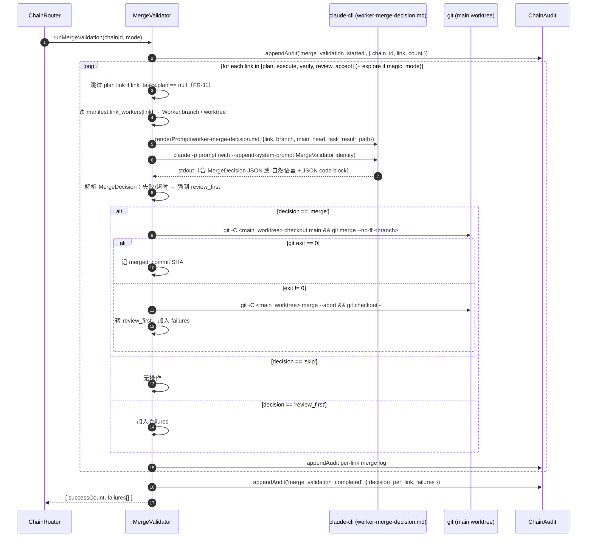
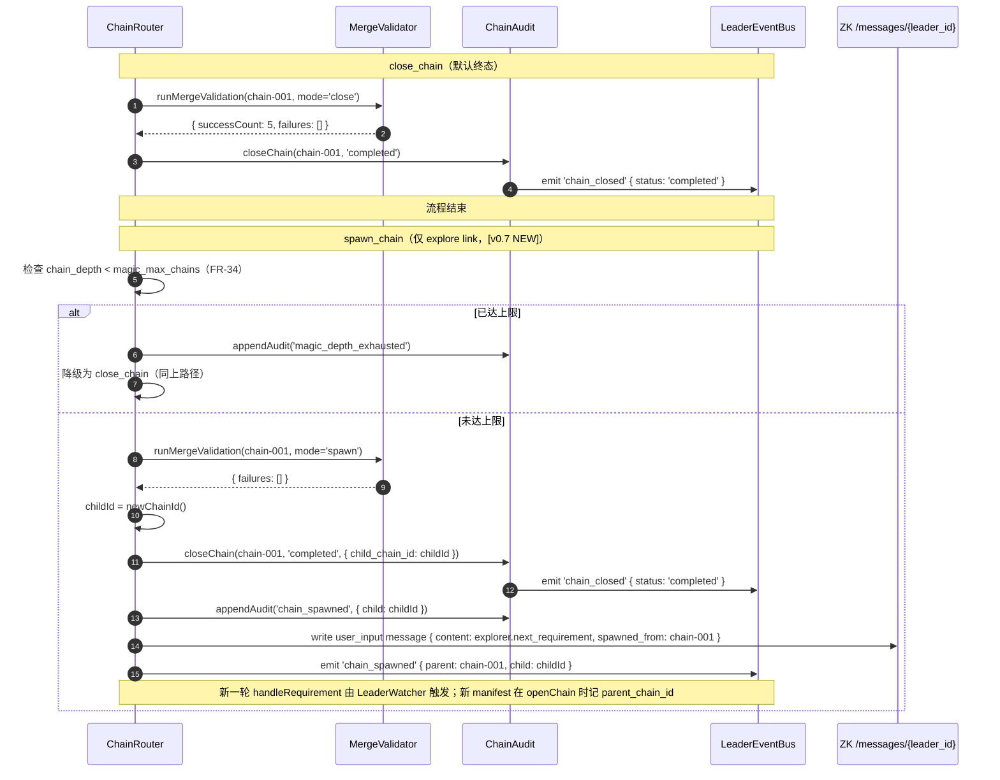

# 07 — MergeValidator 与链关闭

> **DD 定位**：close_chain / spawn_chain 时把链内所有 Worker 分支合并到 main 的完整流程；MergeDecision 三态；merge_failed 路径与 Executor retry；MergeValidator 调用 claude-cli 失败的保守 fallback。
>
> **PRD 锚**：FR-15 / FR-16 / FR-17 / FR-33（merge 复用部分）。
>
> **Schema**：`02-contracts-and-protocol.md` §10 (MergeDecision) + §6 (ChainManifest.merge_failures)。

---

## 1. 设计原则

1. **Leader 不直接执行 git**：所有 merge 决策与执行通过 `worker-merge-decision.md` 模板让 claude-cli 完成 ancestry 检查、决策、合并执行。Leader 只编排（FR-15）。
2. **保守 fallback**：claude-cli 失败 / 输出无法解析 / 超时 → 视作 `review_first`（不动 main）。
3. **失败显式化**：任一 link merge 失败 → 链 `merge_failed` 终态 + 对失败 link 派 retry 给原 Executor（FR-17，不再吞噬错误）。
4. **复用 close 与 spawn**：`close_chain` 与 `spawn_chain` 共用 `runMergeValidation`；后者额外把 child_chain_id 写到父 manifest（详见 `10-magic-loop.md` §4）。

---

## 2. MergeDecision 三态语义

| decision | 触发 | 行为 |
|---|---|---|
| `merge` | claude-cli 判断该 link 的 Worker 分支可干净合并到 main | 执行 `git checkout main && git merge --no-ff <branch> -m "..."`；记录 `merged_commit` SHA |
| `skip` | 分支已合并到 main / 无新 commit / 已是 ancestor | 不动 main；视作"该 link 已就位" |
| `review_first` | 冲突 / claude-cli 解析失败 / ancestry 不明确 | 不动 main；该 link 进入 failures 列表 |

> `review_first` 在 v0.7 中等价于"merge failed for this link"，触发 §4 的 retry 流程。

---

## 3. runMergeValidation 总览

### 3.1 入口

| 调用方 | 触发 | 入口签名 |
|---|---|---|
| ChainRouter（close_chain 决策） | accept link 输出 `close_chain` | `runMergeValidation(chainId, mode='close')` |
| ChainRouter（spawn_chain 决策，v0.7 NEW） | explore link 输出 `spawn_chain` | `runMergeValidation(chainId, mode='spawn')` |

### 3.2 总流程



### 3.3 调用顺序

| link | 顺序 | 说明 |
|---|---|---|
| plan | 1 | 通常无代码，多为 skip；plan=null 时跳过 |
| execute | 2 | 主要代码 commit 所在；冲突最高发 |
| verify | 3 | 多为只读，但 verifier 可能改 doc |
| review | 4 | 同上 |
| accept | 5 | 通常 skip（仅 doc） |
| **explore** | 6（仅 magic_mode） | 通常 skip（Explorer 输出 result.md，不动代码） |

> 不变量：顺序固定且与 NEXT_LINKS 一致。某 link 失败不阻塞后续 link 评估（要把所有 failures 一次收齐，方便操作员一次看清）。

---

## 4. 成功路径与失败路径

### 4.1 成功路径（FR-16）

```text
if failures.empty():
  ChainAudit.closeChain(chainId, 'completed', { child_chain_id?: ... })
  emit LeaderEventBus 'chain_closed' { chain_id, status: 'completed' }
  // mode='spawn' 时由 ChainRouter 继续触发 spawn 后续（详见 10 §4），不在 MergeValidator 内
```

> 不变量：main 分支多 1~N 个 `--no-ff` merge commit（每个 `merge` decision 一个，`skip` 不产生 commit）。

### 4.2 失败路径（FR-17）

```text
if failures.not_empty():
  ChainAudit.closeChain(chainId, 'merge_failed', { failures })
  emit LeaderEventBus 'chain_merge_failed' { chain_id, failures }

  // 派 retry task 给原 Executor
  for failure in failures:
    workerId = manifest.link_workers[failure.link]
    if workerId == null:
      continue                                  // 不该发生；记 debug_info
    retryTask = {
      task_id:    newTaskId(),
      chain_id:   chainId,
      link:       failure.link,                 // 仍是失败的 link（execute / verify / ...）
      title:      `[merge retry] resolve conflict on branch ${failure.branch}`,
      description: renderMergeRetryDescription(failure),
      priority:   'HIGH',
      assigned_to: workerId,                    // 显式指派回原 Worker
      status:     'pending',
      retry_count: 0,
    }
    TaskQueue.push(retryTask)
    ChainAudit.appendAudit('task_dispatch', { task_id, link, assigned_to: workerId, reason: 'merge_retry' })

  // mode='spawn' 时不派生子 chain（PRD §6.5 spawn_chain 在 merge_failed 时退化）
  // 详见 10 §4.3
```

> 关键不变量：
> - chain 的 `manifest.status = 'merge_failed'`（**不**是 `completed`）
> - retry task 的 `assigned_to` 强指派回原 Executor（TaskQueue.claim 排序键 1 命中）
> - retry task 走标准流程：Worker 在 worktree 里 `git pull --rebase origin main` 或 `git merge main` 解冲突 → 重 commit → 自评估 → ChainRouter 重 dispatch 下一 link？

**不**：retry task 只让原 Executor 在自己 worktree 上修通冲突；修通后 Worker 完成自评估输出 `activate_next`（虽 link 已完成，但视作"再确认一次"），ChainRouter 在 link 仍是失败 link 的情形下重新触发对该 chain 的 `runMergeValidation`。这避免链重走一遍 plan→execute→verify→review→accept。

### 4.3 重新 merge 触发条件

```text
ChainRouter.handleCompletionReport(report):
  ...
  if task.assigned_to != null AND task.title.startsWith('[merge retry]'):
    // 这是 §4.2 派出的 retry task；不走常规 activate_next/feedback
    if report.decision != 'activate_next':
      // Executor 自评估不通过（冲突没解决干净 / 主动 reject）→ 链保持 merge_failed
      ChainAudit.appendAudit('debug_info', { message: 'merge retry rejected', task_id })
      return
    // 重新跑 MergeValidator
    runMergeValidation(task.chain_id, mode='close')  // 复 merge；成功 → 链 status 转 completed
```

> 这一段是 ChainRouter 的特例分支；详见 `05-chain-router-and-decisions.md` §4.5。

---

## 5. renderMergeRetryDescription 模板

retry task description 必须包含足够信息让 Executor 自助解冲突：

```text
A merge from your branch <branch_name> to main failed during chain closure.

**Conflict context**:
{{merge_error_excerpt}}

**Your branch**: {{branch_name}}
**Your worktree**: {{worktree_path}}
**Main HEAD at attempt**: {{main_head_sha}}

**What to do**:
1. cd {{worktree_path}}
2. git fetch origin main
3. git merge origin/main   # or git rebase origin/main
4. Resolve conflicts; verify your link's invariants still hold (see {{result_md_path}})
5. git add . && git commit
6. Self-evaluate as usual; if confident, output activate_next.

After your retry, MergeValidator will re-run automatically.
```

> 渲染由 ChainRouter 完成（不需要 claude-cli），变量从 manifest + failures 拿。

---

## 6. MergeValidator claude-cli 调用细节

### 6.1 worker-merge-decision.md 调用

| 字段 | 内容 |
|---|---|
| 系统 prompt | "You are MergeValidator..." 三段身份卡变体（详见 `03-identity-and-roles.md` §4.3） |
| 用户 prompt | 渲染 `worker-merge-decision.md`，含：当前 link、待合并 branch、main HEAD SHA、`git log <branch> ^main` 摘要、对应 result.md 路径 |
| 命令 | `claude --append-system-prompt '<identity>' -p '<prompt>'`（与 Worker 一致） |
| 日志 | `merges/chain-<chain_id>/merge-<link>-<ts>.log`（详见 `09-audit-and-cache.md` §5.3） |

### 6.2 输出解析

期望 stdout 含一个 MergeDecision JSON code block：

````
```json
{ "decision": "merge", "reason": "fast-forward possible; no conflict markers", "merged_commit": null }
```
````

> `merged_commit` 由 MergeValidator 在执行 merge 后填入（claude-cli 输出此字段时只是占位）。

### 6.3 失败回退

| 故障 | 行为 |
|---|---|
| claude-cli 超时（默认 5 分钟硬上限） | 返回 `review_first` |
| stdout 无法解析为 MergeDecision | 返回 `review_first` |
| `decision == merge` 但 git merge 命令失败 | `git merge --abort`，转 `review_first` |

### 6.4 ancestry 检查放在哪

PRD FR-15 明示 ancestry 检查交给 claude-cli 通过 `worker-merge-decision.md` 内的提示完成（如让 Claude 执行 `git merge-base --is-ancestor`）。MergeValidator 不在 TS 中重做硬编码的 ancestry 判断 —— 避免与 Claude 上下文感知重复且潜在不一致。这与 v0.6 一致，v0.7 不变。

---

## 7. close_chain 与 spawn_chain 时序对比 **[v0.7 NEW]**



> spawn 路径下若 `failures.not_empty()`：与 close 完全一致 — 链转 `merge_failed`、派 Executor retry、**不**派生子链（PRD §6.5）。Explorer 的 `next_requirement` 被丢弃（audit 记 `debug_info`，操作员需重新发起需求）。

---

## 8. 与其它 DD 文件交叉

| 主题 | 主文件 |
|---|---|
| MergeDecision schema | `02-contracts-and-protocol.md` §10 |
| ChainAudit.closeChain 字段 | `09-audit-and-cache.md` §1.5 |
| TaskQueue.push retry task | `06-tasks-and-workers.md` §2 |
| ChainRouter merge retry 特例分支 | `05-chain-router-and-decisions.md` §4.5 |
| spawn_chain 端到端 | `10-magic-loop.md` §4 |
| TUI 红字渲染 | `04-tui-and-input.md` §4 |
| merges/ 日志布局 | `09-audit-and-cache.md` §5.3 |
