# 07 — MergeValidator �链关闭

> **DD 定�**：close_chain / spawn_chain 时把链的 accept-link 分支�并到 main 的完整�程；MergeDecision 三�；merge_failed 路径� Executor retry；MergeValidator 调用 claude-cli 失败的�守 fallback；git 错误五分类（ 模�）。
>
> **PRD 锚**：FR-15 / FR-16 / FR-17 / FR-33（merge �用部分）/ FR-36（git 错误五分类）。
>
> **Schema**：`02-contracts-and-protocol.md` §10 (MergeDecision) + §6 (ChainManifest.merge_failures) + §6.0 (LinkCommitRecord)。

---

## 1. 设计�则

1. **�次�并 accept-link 分支（，rc1 worktree 工作�）**：close_chain 时 MergeValidator **�**�并 accept-link 的 Worker 分支到 main，而��"� link ��"。�行性�自 Worker pre-task rebase（`06-tasks-and-workers.md` §3.5）—— 链的 plan � build � verify � review � accept 分支被线性串�，accept 分支是整�链的 tip。
2. **Leader �代���执行 git**：`isCommitMerged` 用 `git merge-base --is-ancestor` 在 Leader 侧直�判断，�����并；真正的 `git merge` �委托 MergeValidator 在 main 工作树执行。MergeDecision 由 claude-cli 通过 `worker-merge-decision.md` 给出（决策），但 ancestry 检测��赖 claude（FR-15）。
3. **�守 fallback**：claude-cli 失败 / 输出无法解� / 超时 → `decision='review_first'`（�动 main）。
4. **git 错误五分类**：merge 期 git 失败按错误类分�——**conflict**� **other**触� retry，**worktree_locked / permission / network** ��试（详� §6.6）。
5. **失败显�化**：merge 失败 → 链 `merge_failed` 终�；conflict 类对 accept-link Worker 派 retry（FR-17）；�/��/网络类�派 retry，audit �等待�作员介入。
6. **�用 close � spawn**：`close_chain` � `spawn_chain` 共用 `runCloseChainMerge`；�者�外把 child_chain_id 写到父 manifest（详� `10-magic-loop.md` §4）。
7. **git 命令调用纪律**：所有 `git` 调用使用 `execFileSync('git', args[])` 数组形�，**严�** shell 字符串拼� —— 防止 worktree 路径 / SHA / 分支�中的特殊字符引�命令注入。代�归�：`packages/leader/src/merge-validator.ts:190`（`execGit`）。

---

## 2. MergeDecision 三�语义

| decision | 触� | 行为 |
|---|---|---|
| `merge` | claude-cli 判断该 link 的 Worker 分支�干净�并到 main | 执行 `git checkout main && git merge --no-ff <branch> -m "..."`；记录 `merged_commit` SHA |
| `skip` | 分支已�并到 main / 无新 commit / 已是 ancestor | �动 main；视作"该 link 已就�" |
| `review_first` | 冲� / claude-cli 解�失败 / ancestry ��确 | �动 main；该 link 进入 failures 列表 |

> `review_first` 在 v0.7 中等价�"merge failed for this link"，触� §4 的 retry �程。

---

## 3. runMergeValidation 总览

### 3.1 入�

| 调用方 | 触� | 入�签� |
|---|---|---|
| ChainRouter（close_chain 决策） | accept link 输出 `close_chain` | `runMergeValidation(chainId, mode='close')` |
| ChainRouter（spawn_chain 决策，¼‰ | explore link 输出 `spawn_chain` | `runMergeValidation(chainId, mode='spawn')` |

### 3.2 总�程（ �次�并 accept-link）

```mermaid
sequenceDiagram
  autonumber
  participant CR as ChainRouter
  participant CA as ChainAudit
  participant MV as MergeValidator
  participant CL as claude-cli (worker-merge-decision.md)
  participant GIT as git (project root, main worktree)
  participant BUS as LeaderEventBus

  CR->>CA: readManifest(chainId)
  CA-->>CR: { link_commits.accept: { worktree, branch, docs } }
  alt accept link_commits 缺失（legacy / 旧 Worker）
    CR->>CR: fallback 走 §6.7 legacy � link 迭代
  else 正常路径
    CR->>MV: validate({sha: accept.worktree, branch: accept.branch, link:'accept', ...})
    MV->>GIT: mainBranch = (opts.merge_target_branch ?? git rev-parse --abbrev-ref HEAD)
    opt config.git.remote != null
      MV->>GIT: git fetch <remote> <mainBranch>
      Note over MV,GIT: 失败 → classifyGitError → 抛 GitNetworkError/Permission/Locked
    end
    MV->>MV: isCommitMerged(accept.worktree, mainBranch)?
    alt 已是 main 的 ancestor
      MV-->>CR: { decision: 'skip', reason: 'Already merged' }
    else �是 ancestor
      MV->>CL: claude -p renderPrompt(worker-merge-decision.md, {branch, sha, main_branch, ...})
      CL-->>MV: stdout (MergeDecision JSON)
      MV->>MV: 解�；失败 → throw ValidationError → ChainRouter 视为 review_first
      alt decision == 'merge'
        MV->>GIT: git checkout <mainBranch>
        MV->>GIT: git merge --no-ff <accept.branch> -m "Merge ..."
        alt git exit == 0
          MV->>BUS: emit 'debug_info' (merged)
          MV-->>CR: { decision: 'merge', ... }
        else exit != 0
          MV->>GIT: git merge --abort + git checkout <prev_branch>
          MV->>MV: classifyGitError → MergeConflictError | WorktreeLockedError | GitPermissionError | GitNetworkError | Error
          MV-->>CR: throw <分类的错误>
        end
      else decision in {skip, review_first}
        MV-->>CR: decision
      end
    end
  end
  CR->>CA: appendAudit('merge_validation_completed', { decision, sha, branch, error_class? })
```



代�归�：`packages/leader/src/merge-validator.ts:52`（`validate`）+ `packages/leader/src/chain-router.ts:825`（`runCloseChainMerge`）。

### 3.3 为什么��并 accept-link

| 设计点 | rc0 模�（已废弃） | 模� |
|---|---|---|
| �并粒度 | � link ��，� link 一个 merge commit | �次�并 accept 分支 |
| 链内 commit 关系 | � link 分支独立 fork from main | plan � build � verify � review � accept 线性串�（pre-task rebase ��） |
| main 上的 commit 数 | 1~N 个 `--no-ff` merge | 1 个 `--no-ff` merge（�整�链的代�） |
| 冲�暴露� | � link 都�能冲� | 仅 accept 分支� main 之间一次冲� |
| close_chain ��度 | O(N) 决策 + O(N) git �作 | O(1) 决策 + O(1) git �作 |
| retry 目标 | 失败 link 的 Worker | accept-link Worker（汇�所有上游） |

> ���：
> - accept-link 的 worktree 分支 == 链所有代�产出的线性 tip（因 §3.5 pre-task rebase）。
> - 若 plan / build / verify / review 任一 link �动代�（`worktree=null`），其分支�存在但 commit �上游� SHA —— accept �能拿到完整链��。
> - merge 决策�问 claude-cli **一次**（�是 5 次），�显节约 token / 延迟。

---

## 4. �功路径�失败路径

### 4.1 �功路径（FR-16）

```text
if failures.empty():
  ChainAudit.closeChain(chainId, 'completed', { child_chain_id?: ChainId })
  // ↑ 注：closeChain extra �数是 **�数** child_chain_id（本次 spawn 的�链 ID）；
  //   ChainAudit 内部 push 到 manifest.child_chain_ids[] 数组（02 §6 ChainManifest 字段是 child_chain_ids）。
  //   关闭一次最多新�一个�链；close（� spawn）时�略该字段。
  emit LeaderEventBus 'chain_closed' { chain_id, status: 'completed' }
  // mode='spawn' 时由 ChainRouter 继续触� spawn �续（详� 10 §4），�在 MergeValidator 内
```

> ���：
> - 模�下 main 分支�好多 **1 个** `--no-ff` merge commit（accept �分支�并）；rc0 legacy fallback 路径�为 1~N。
> - `skip` decision �产生 commit（accept 已是 main 的 ancestor）。

### 4.2 失败路径（FR-17）

```text
if failures.not_empty():
  ChainAudit.closeChain(chainId, 'merge_failed', { failures })
  emit LeaderEventBus 'chain_merge_failed' { chain_id, failures }

  // 派 retry task —— 仅 conflict 类（ 五分类）
  for failure in failures:
    if failure.category != 'conflict':
      // worktree_locked / permission / network / other → ��试；audit �等待�作员
      ChainAudit.appendAudit('merge_failure', { category, error, sha, branch })
      continue

    workerId = manifest.link_workers['accept']   // 始终是 accept-link Worker
    if workerId == null:
      continue                                  // �该�生；记 debug_info
    retryTask = {
      task_id:    newTaskId(),
      chain_id:   chainId,
      link:       'accept',                     // 始终是 accept-link
      title:      `[merge retry] resolve conflict on branch ${failure.branch}`,
      description: renderMergeRetryDescription(failure),
      priority:   'HIGH',
      assigned_to: workerId,
      status:     'pending',
      retry_count: 0,
    }
    TaskQueue.push(retryTask)
    ChainAudit.appendAudit('task_dispatch', { task_id, link:'accept', assigned_to: workerId, reason: 'merge_retry' })

  // mode='spawn' 时�派生� chain（PRD §6.5 spawn_chain 在 merge_failed 时退化）
  // 详� 10 §4.3
```

> 关键���：
> - chain 的 `manifest.status = 'merge_failed'`（**�**是 `completed`）。
> - retry task 的 `assigned_to` 强指派� **accept-link Worker**（rc1 模�下他汇�整�链的代�，是�并目标的唯一所有者）。**�**�� rc0 那样按 failure.link 派给 plan/build/verify/review 的 Worker。
> - retry task 走标准�程：accept Worker 在自己 worktree 里 fetch + rebase / merge main 解冲� → � commit → 自评估 → ChainRouter �新触� `runCloseChainMerge`。
> - 仅 conflict 类失败触� retry；�/��/网络类**�**派 retry task —— 这些是基础设施问题，�� retry 无�义，由 audit �示�作员�查。

### 4.3 �新 merge 触��件

```text
ChainRouter.handleCompletionReport(report):
  ...
  if task.assigned_to != null AND task.title.startsWith('[merge retry]'):
    // 这是 §4.2 派出的 retry task；�走常规 activate_next/feedback
    if report.decision != 'activate_next':
      // Executor 自评估�通过（冲�没解决干净 / 主动 reject）→ 链�� merge_failed
      ChainAudit.appendAudit('debug_info', { message: 'merge retry rejected', task_id })
      return
    // �新跑 MergeValidator
    runMergeValidation(task.chain_id, mode='close')  // � merge；�功 → 链 status 转 completed
```

> 这一段是 ChainRouter 的特例分支；详� `05-chain-router-and-decisions.md` §4.5。

---

## 5. renderMergeRetryDescription 模�

retry task description 必须包�足够信�让 Executor 自助解冲�：

```text
A merge from your branch <branch_name> to main failed during chain closure.

**Conflict context**:
{{merge_error_excerpt}}

**Your branch**: {{branch_name}}
**Your worktree**: {{worktree_path}}
**Main HEAD at attempt**: {{main_head_sha}}

**What to do**:
1. cd {{worktree_path}}
2. git fetch origin main
3. git merge origin/main   # or git rebase origin/main
4. Resolve conflicts; verify your link's invariants still hold (see {{result_md_path}})
5. git add . && git commit
6. Self-evaluate as usual; if confident, output activate_next.

After your retry, MergeValidator will re-run automatically.
```

> 渲染由 ChainRouter 完�（�需� claude-cli），��� manifest + failures 拿。

---

## 6. MergeValidator claude-cli 调用细节

### 6.1 worker-merge-decision.md 调用

| 字段 | 内容 |
|---|---|
| 系统 prompt | "You are MergeValidator..." 三段身份��体（详� `03-identity-and-roles.md` §4.3） |
| 用户 prompt | 渲染 `worker-merge-decision.md`，�：当� link�待�并 branch�main HEAD SHA�`git log <branch> ^main` 摘��对应 result.md 路径 |
| 命令 | `claude --append-system-prompt '<identity>' -p '<prompt>'`（� Worker 一致） |
| 日志 | `merges/chain-<chain_id>/merge-<link>-<ts>.log`（详� `09-audit-and-cache.md` §5.3） |

### 6.2 输出解�

期望 stdout �一个 MergeDecision JSON code block：

````
```json
{ "decision": "merge", "reason": "fast-forward possible; no conflict markers", "merged_commit": null }
```
````

> `merged_commit` 由 MergeValidator 在执行 merge �填入（claude-cli 输出此字段时�是��）。

### 6.3 失败�退

| 故障 | 行为 |
|---|---|
| claude-cli 超时（默认 5 分钟硬上�） | ValidationError → ChainRouter 视作 `review_first` |
| stdout 无法解�为 MergeDecision | �上 |
| `decision == merge` 但 git merge 命令失败（conflict 类）| `git merge --abort` + `git checkout <prev>`，抛 `MergeConflictError(branch, conflict_files)` → retry |
| `decision == merge` 但 git merge 命令失败（lock / permission / network）| `git merge --abort` + `git checkout <prev>`，抛对应 Git*Error → � retry，audit |

### 6.4 ancestry 检查放在哪 **[ 修订]**

模�下，ancestry 检查由 MergeValidator 在 TS 层直��：`git merge-base --is-ancestor <sha> <main_branch>`，退出� 0 = 是 ancestor → `decision='skip'`；退出� 1 = �是 ancestor → 继续问 claude；其它退出� → `classifyGitError` 抛对应 Git*Error。

**为什么� claude 改� TS**：v0.6 让 claude � ancestry 是为了利用上下文感知，但在 shared `.git` 多 Worker 的场景下，`git branch --contains <sha>` 永远返� true（因为 worker-A 的�交在 worker-B 的分支引用里也能"reach"），导致 v0.6 ��**�默跳过所有 merge**。rc1 直�用 `merge-base --is-ancestor` 修正这个 bug。代�归�：`packages/leader/src/merge-validator.ts:164`（`isCommitMerged`）。

### 6.5 isCommitMerged ��

```ts
private isCommitMerged(sha: string, mainBranch: string): boolean {
  try {
    execFileSync('git', ['merge-base', '--is-ancestor', sha, mainBranch], {
      cwd: this.opts.project_root,
      stdio: ['pipe', 'pipe', 'pipe'],
    });
    return true;                                  // 退出� 0
  } catch (err) {
    const status = (err as { status?: number }).status;
    if (status === 1) return false;               // �确"�是 ancestor"
    throw classifyGitError(err, 'merge-base failed');  // sha / branch 缺失 / repo ��
  }
}
```

> 关键：退出� 1 �"其它�零"必须分开处�。把"其它�零"当� `false` 会导致�一类问题（如分支�拼错�SHA �存在）被误判为"未�并"而触� merge，进一步污染 main。

### 6.6 git 错误五分类

`classifyGitError(err, fallback)` 按 stderr 模�匹�映射到 5 个错误类：

| 错误类 | stderr 关键� | retry？ | 路由 |
|---|---|---|---|
| `MergeConflictError` | `<<<<<<< ` 标记 / `CONFLICT (content):` / unmerged paths �空 | ✅ | 派 retry 给 accept-link Worker（§4.2） |
| `WorktreeLockedError` | `cannot lock ref` / `index.lock` / `unable to create.*\.lock` | � | audit `merge_failure` { category:'worktree_locked' }；�示�作员 |
| `GitPermissionError` | `permission denied` / `read-only file system` | � | audit + �作员�查 |
| `GitNetworkError` | `could not resolve host` / `connection refused / timed out` / `network is unreachable` / `cannot access` | � | audit；建议设 `git.remote=null` 或�查网络 |
| 其它 `Error` | 未匹�上�任何模� | ✅（视作 conflict 类） | 派 retry —— �守路径，��把未知失败�� |

代�归�：`packages/leader/src/merge-validator.ts:204`（`classifyGitError`）+ `packages/leader/src/chain-router.ts:884`（`categorizeMergeError`）。

PRD 锚：FR-36（ git 错误五分类）。

### 6.7 Legacy fallback（manifest 无 link_commits）

当 `manifest.link_commits.accept` 缺失或 `worktree=null`（旧 Worker / accept 全为 docs-only），ChainRouter 退� v0.6 的� link 迭代（`runMergeValidation`，代� `chain-router.ts:899`）。该路径**仅作兼容**：

```text
runMergeValidation(chainId) -> failures[]:
  failures = []
  for link in ['plan', 'build', 'verify', 'review', 'accept']:
    record = manifest.link_commits?[link]
    if record == null || record.worktree == null:
      continue                                  // 跳过无 commit 的 link
    try:
      MergeValidator.validate({sha: record.worktree, branch: record.branch, ...})
    catch err:
      failures.push({link, sha: record.worktree, branch, error, category})
      continue                                   // 收�所有 link 的失败�返�
  return failures
```

> ���：legacy 路径�走 §6.6 错误五分类，retry 派给"失败 link 的� Worker"而� accept Worker（因为� link 分支独立，未线性串�）。新部署应总走 §3.2 �分支路径。

---

## 7. close_chain � spawn_chain 时�对比

```mermaid
sequenceDiagram
  autonumber
  participant CR as ChainRouter
  participant MV as MergeValidator
  participant CA as ChainAudit
  participant EB as LeaderEventBus
  participant ZK as ZK /messages/{leader_id}

  Note over CR,EB: close_chain（默认终�）
  CR->>MV: runMergeValidation(chain-001, mode='close')
  MV-->>CR: { successCount: 5, failures: [] }
  CR->>CA: closeChain(chain-001, 'completed')
  CA->>EB: emit 'chain_closed' { status: 'completed' }
  Note over CR,EB: �程结�

  Note over CR,EB: spawn_chain（仅 explore link，）
  CR->>CR: 检查 chain_depth < magic_max_chains（FR-34）
  alt 已达上�
    CR->>CA: appendAudit('magic_depth_exhausted')
    CR->>CR: �级为 close_chain（�上路径）
  else 未达上�
    CR->>MV: runMergeValidation(chain-001, mode='spawn')
    MV-->>CR: { failures: [] }
    CR->>CR: childId = newChainId()
    CR->>CA: closeChain(chain-001, 'completed', { child_chain_id: childId })
    CA->>EB: emit 'chain_closed' { status: 'completed' }
    CR->>CA: appendAudit('chain_spawned', { child: childId })
    CR->>ZK: write user_input message { content: explorer.next_requirement, spawned_from: chain-001 }
    CR->>EB: emit 'chain_spawned' { parent: chain-001, child: childId }
    Note over CR,EB: 新一轮 handleRequirement 由 LeaderWatcher 触�；新 manifest 在 openChain 时记 parent_chain_id
  end
```



> spawn 路径下若 `failures.not_empty()`：� close 完全一致 — 链转 `merge_failed`�派 Executor retry�**�**派生�链（PRD §6.5）。Explorer 的 `next_requirement` 被丢弃（audit 记 `debug_info`，�作员需�新�起需求）。

---

## 8. �其它 DD 文件交�

| 主题 | 主文件 |
|---|---|
| MergeDecision schema | `02-contracts-and-protocol.md` §10 |
| ChainAudit.closeChain 字段 | `09-audit-and-cache.md` §1.5 |
| TaskQueue.push retry task | `06-tasks-and-workers.md` §2 |
| ChainRouter merge retry 特例分支 | `05-chain-router-and-decisions.md` §4.5 |
| spawn_chain 端到端 | `10-magic-loop.md` §4 |
| TUI 红字渲染 | `04-tui-and-input.md` §4 |
| merges/ 日志布局 | `09-audit-and-cache.md` §5.3 |
