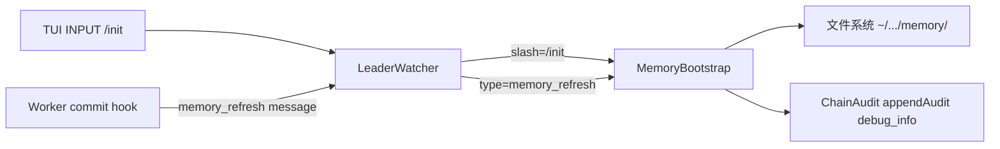
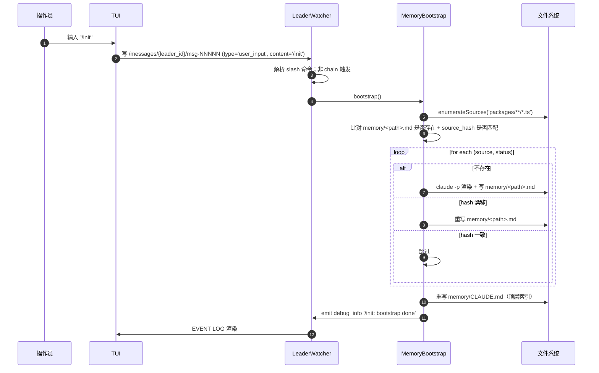

# 08 — Workspace Memory 与 bootstrap

> **DD 定位**：`/init` slash 触发 bootstrap、memory_refresh 增量、refreshStale 漂移检测、memory 卡片 front-matter schema、CLAUDE.md 索引生成。
>
> **PRD 锚**：FR-28 / FR-29 / FR-30。
>
> **Schema**：本文定义 `MemoryCardSchema` 与 `memory/` 目录布局。

---

## 1. 模块概览



| 组件 | 职责 |
|---|---|
| **MemoryBootstrap** | 枚举源文件 → 生成 memory 卡片；增量刷新；陈旧扫描 |
| **LeaderWatcher** | 收到 `/init` slash 或 `memory_refresh` 消息 → 调 MemoryBootstrap |
| **Worker CommitChecker** | 任务 commit 后发 `memory_refresh` 消息给 Leader |

---

## 2. Memory 目录布局

```
~/.claude-orchestrator/projects/<leader_id>/memory/
├── CLAUDE.md                           # 顶层索引（自动生成）
└── packages/
    ├── contracts/src/links.ts.md       # 单文件 memory 卡片
    ├── contracts/src/roleWeights.ts.md
    ├── leader/src/chain-router.ts.md
    └── ...                             # 镜像 packages/**/*.ts 路径结构
```

> 当前枚举范围：**仅 `packages/**/*.ts`**（PRD §6 已知边界明示不覆盖 tests / docs / templates / skills / scripts）。

---

## 3. MemoryCard schema

每个 memory 卡片是 markdown 文件，含 YAML front-matter：

```markdown
---
source_path: packages/leader/src/chain-router.ts
source_hash: sha256:a1b2c3d4...
generated_at: 2026-05-18T05:08:00.123Z
generator_version: 0.7.0
---

# packages/leader/src/chain-router.ts

## Purpose
<本文件做什么的一句话>

## Key exports
- `ChainRouter`: ...
- `handleRequirement(msg)`: ...
- `handleCompletionReport(msg)`: ...

## Dependencies
- `@co/contracts` (TaskLink, EvalDecision, ChainManifest)
- `./merge-validator`
- `./chain-audit`

## Notes
<其它关键约束、不变量、坑>
```

### 3.1 Zod schema

```ts
export const MemoryCardFrontMatterSchema = z.object({
  source_path:       z.string(),                  // 项目根相对路径
  source_hash:       z.string().regex(/^sha256:[0-9a-f]{64}$/),
  generated_at:      z.string().datetime(),
  generator_version: z.literal('0.7.0'),
});
export type MemoryCardFrontMatter = z.infer<typeof MemoryCardFrontMatterSchema>;
```

### 3.2 source_hash 计算

```text
source_hash = 'sha256:' + sha256(readFileBytes(source_path)).hex()
```

> 文件按字节计 hash；行尾差异（CRLF vs LF）会被 git checkout 默认归一化后再 hash，与 git index 行为一致。

---

## 4. `/init` slash 触发 bootstrap

### 4.1 流程



### 4.2 enumerateSources

```text
enumerateSources(globPattern):
  files = []
  for entry in glob(globPattern):
    if not entry.endsWith('.ts'): continue
    if entry includes 'node_modules' or '.test.ts' or 'dist/': continue
    files.push(entry)
  return files.sort()
```

> v0.7 严格 `*.ts`：`.tsx` / `.d.ts` / `.test.ts` 都不收。`.d.ts` 是声明文件，无业务逻辑；`.test.ts` 候选 v0.8。

### 4.3 单卡片生成（claude-cli）

```text
generateMemoryCard(sourcePath):
  source = readFile(sourcePath)
  sourceHash = sha256(source)
  prompt = renderTemplate('memory-card.md', {
    source_path: sourcePath,
    source_content: source,
    generator_version: '0.7.0',
  })
  out = claude -p prompt           // 输出 markdown 主体
  card = `---\nsource_path: ${sourcePath}\nsource_hash: sha256:${sourceHash}\ngenerated_at: ${now()}\ngenerator_version: 0.7.0\n---\n\n${out}`
  writeFile(memoryPath(sourcePath), card)
```

> `memoryPath(source) = '<cache>/memory/' + source + '.md'`（路径镜像）。

### 4.4 CLAUDE.md 顶层索引

```text
regenerateIndex():
  cards = listMemoryCards()
  content = '# Project Memory Index\n\n'
  for card in cards.sortBySourcePath():
    fm = parseFrontMatter(card)
    content += `- [${fm.source_path}](./${relPath(card)})\n`
  writeFile(memoryDir + '/CLAUDE.md', content)
```

---

## 5. `memory_refresh` 增量（FR-29）

### 5.1 Worker 端触发

Worker.CommitChecker `maybeCommit` 返回 `{ committed: true, sha }` 后立即触发：

```text
notifyMemoryRefresh(committed_files):
  msg = {
    message_id: newMessageId(),
    type: 'memory_refresh',
    from: <self>,
    to: <leader_id>,
    content: JSON.stringify({
      worker:          <self.name>,
      committed_files, // ['packages/leader/src/chain-router.ts', ...]
      commit_sha:      sha,
    }),
    created_at: now(),
  }
  zk.create('/messages/{leader_id}/msg-NNNNN', payload=msg)
```

### 5.2 Leader 端处理

```text
LeaderWatcher.onMessage(msg):
  if msg.type == 'memory_refresh':
    payload = JSON.parse(msg.content)
    for path in payload.committed_files:
      if !matchesGlob(path, 'packages/**/*.ts'): continue
      MemoryBootstrap.regenerateOne(path)
    MemoryBootstrap.regenerateIndex()
    emit debug_info `memory refreshed: ${payload.committed_files.length} files`
```

> 不计入 chain audit；memory_refresh 与 chain 无关。

---

## 6. `refreshStale` 陈旧扫描（FR-30）

### 6.1 触发

每次 `/init` 调 bootstrap 时自动包含 refreshStale 行为（详见 §4.1 流程中的"hash 漂移"分支）。这覆盖以下场景：

- Worker 在 `--no-verify` 或外部脚本触发的 commit 没有 memory_refresh 消息
- 用户在主 worktree 手工修改 + commit
- 外部工具批量修改源码

### 6.2 算法

```text
refreshStale():
  staleCount = 0
  for source in enumerateSources('packages/**/*.ts'):
    card = readMemoryCard(memoryPath(source))
    if card == null:
      generateMemoryCard(source); staleCount++
      continue
    currentHash = sha256(readFile(source))
    if card.front_matter.source_hash != 'sha256:' + currentHash:
      generateMemoryCard(source)              // 覆写
      staleCount++
  if staleCount > 0:
    emit debug_info `stale entries refreshed: ${staleCount}`
```

> `/init` 完成后用户能在 EVENT LOG 看到 `/init: bootstrap done` 与（如有）`stale entries refreshed: N` 两条事件。

---

## 7. 失败保护

| 失败 | 行为 |
|---|---|
| `claude -p` 渲染卡片失败 | 跳过该文件；保留旧卡片；emit `debug_info` |
| 源文件读失败 | 跳过该文件；保留旧卡片；emit `debug_info` |
| memory/ 目录写权限不足 | bootstrap 整体失败；emit `debug_info` "memory dir not writable" |
| sha256 计算失败（罕见） | 跳过；emit `debug_info` |

> MemoryBootstrap 不抛异常到 LeaderWatcher 顶层 —— `/init` 失败不影响 Leader 正常运转。

---

## 8. 不在 v0.7 的部分（PRD §6 已知边界）

- `tests/` / `docs/` / `templates/` / `skills/` / `scripts/` 不在 enumerate 范围（候选 v0.8）
- 卡片不支持 cross-reference（候选 v0.8 增加 `dependencies` 字段的图）
- memory bootstrap 不上 ZK（纯本地文件）
- memory 卡片不与 chain audit 关联；不能"反查某个 commit 触发了哪些 refresh"

---

## 9. 与其它 DD 文件交叉

| 主题 | 主文件 |
|---|---|
| Message schema (type='memory_refresh') | `02-contracts-and-protocol.md` §9 |
| LeaderWatcher 消息派发 | `05-chain-router-and-decisions.md` §1 |
| Worker.CommitChecker 触发点 | `06-tasks-and-workers.md` §4 |
| 缓存目录布局 | `09-audit-and-cache.md` §5 |
| Hook 触发（task_completed 与 memory_refresh 独立） | `09-audit-and-cache.md` §6 |
