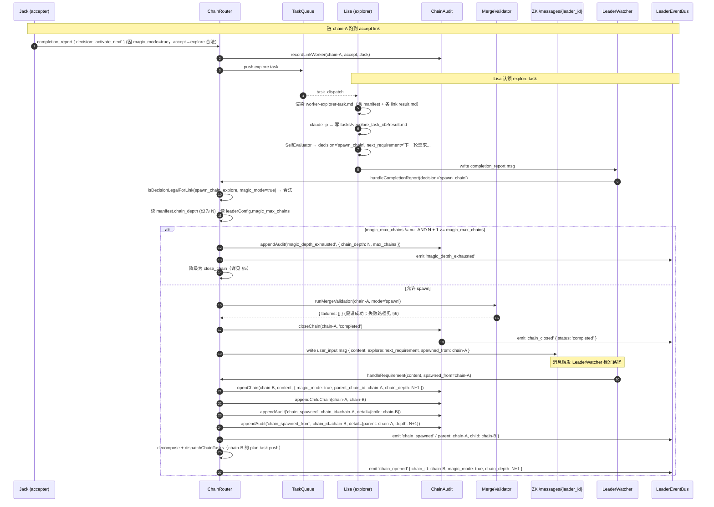
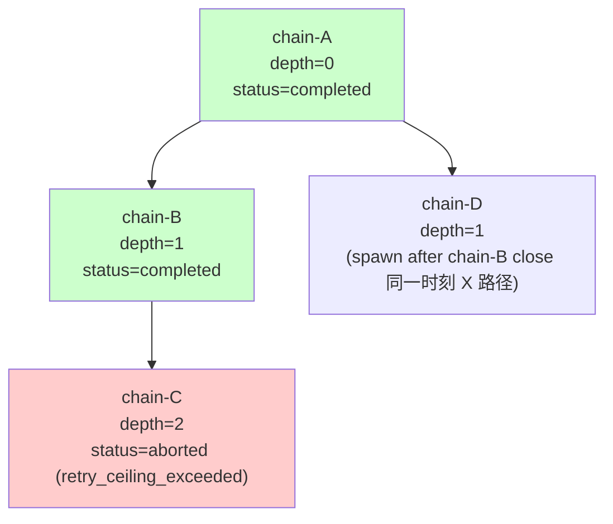

# 10 — `--magic` 自主循环

> **DD 定位**： 5 条 FR（FR-31 ~ FR-35）的端到端贯穿；自主循环的生命周期、终止条件、Chain Forest 模型、协议不兼容性收束。
>
> **本文角色**：聚合视图。细则在其它文件深度展开：
> - schema 在 `02-contracts-and-protocol.md` §3 / §5 / §6
> - explorer 角色与 magic role 分配 在 `03-identity-and-roles.md`
> - spawn_chain 路由逻辑 在 `05-chain-router-and-decisions.md` §4.6
> - Explorer task prompt 在 `06-tasks-and-workers.md` §11
> - MergeValidator 复用 在 `07-merge-validator-and-closure.md` §7
> - manifest 扩展与 audit 增量 在 `09-audit-and-cache.md` §1.3 / §4.3
>
> **PRD 锚**：FR-31 / FR-32 / FR-33 / FR-34 / FR-35；03-scenarios.md S-10。

---

## 1. `--magic` 与 `--magic-max-chains` 配置传播

### 1.1 CLI 入口

```bash
claude-orchestrator run --worker N --magic [--magic-max-chains M]
```

| 参数 | 默认 | 范围 | 覆写 |
|---|---|---|---|
| `--magic` | 关 | flag | — |
| `--magic-max-chains M` | `unlimited`（null） | int ≥ 1 | env `CO_MAGIC_MAX_CHAINS` |

### 1.2 传播路径

```
CLI argv
   ↓
orchestrator/run.ts 解析 → { magic: bool, magicMaxChains: number | null }
   ↓
WorktreeInitializer.initialize(N, magicMode)   ← 影响 role 分配（详见 03 §2.2）
   ↓
Leader 启动时写入 /leader 节点 payload:
   { protocol_version: "0.7.0", magic_mode: bool, magic_max_chains: number | null }
   ↓
Worker child-runner 读 /leader 节点：
   - 校验 protocol_version
   - 记 magic_mode 到本地 Config（用于 SelfEvaluator.isDecisionLegalForLink）
```

### 1.3 配置在 manifest 中的固化

每条 chain 在 `openChain` 时把 `magic_mode` / `chain_depth` / `parent_chain_id` 写入 manifest（详见 `02-contracts-and-protocol.md` §6.2）。这让"链生命周期内"的 magic 决策不依赖 Leader 运行期变量，避免 Leader 崩溃重启后状态丢失。

---

## 2. 协议变更收束

| 维度 | | 主文件 |
|---|---|---|
| `TaskLink` 新增 `explore` + 重命名 `build→execute` | schema | `02-contracts-and-protocol.md` §3.1 |
| `InstanceRole` 新增 `explorer` + 重命名 `builder→executor` | schema | `02-contracts-and-protocol.md` §3.2 |
| `roleWeights` 新增 `explorer` 行与 `explore` 列 | 常量 | `02-contracts-and-protocol.md` §4 |
| `EvalDecision` 新增 `spawn_chain` 第 5 态 | schema | `02-contracts-and-protocol.md` §5 |
| `ChainManifest` 新增 4 字段（parent_chain_id / child_chain_ids / chain_depth / magic_mode） | schema | `02-contracts-and-protocol.md` §6 |
| `ChainDef` 新增可选 `explore` 字段 | schema | `02-contracts-and-protocol.md` §7 |
| `Message` 新增可选 `spawned_from` / `next_requirement` | schema | `02-contracts-and-protocol.md` §9 |
| `PROTOCOL_VERSION` 升至 `"0.7.0"` 并校验 | 常量 | `02-contracts-and-protocol.md` §1 |
| 错误类 `MagicDepthExhaustedError`（保留，主路径用 audit + 降级处理） | TS class | `02-contracts-and-protocol.md` §12 |
| Audit 事件 `chain_spawned` / `chain_spawned_from` / `magic_depth_exhausted` / `invalid_decision` | enum | `02-contracts-and-protocol.md` §13 + `09-audit-and-cache.md` §4.3 |

---

## 3. decompose 模板的 magic 上下文

ChainRouter.handleRequirement 调 `decomposeRequirement(requirement, { magic_mode, chain_id })`（详见 `05-chain-router-and-decisions.md` §3.3）。

### 3.1 模板差异

| 字段 | `magic_mode=false` | `magic_mode=true` |
|---|---|---|
| `worker-decompose.md` prompt 上下文 | "拆解为 5 任务" | "拆解为 6 任务，最后一个为 explore" |
| 期望输出 ChainDef 字段 | plan / execute / verify / review / accept | + explore |
| 输出 explore.description 模板 | — | "审视当前 chain 全貌；基于现有产出决定 spawn_chain（含 next_requirement）或 close_chain" |

### 3.2 校验

ChainRouter 在 `ChainDefSchema.parse` 之后做语义校验（详见 `05-chain-router-and-decisions.md` §3.2 步骤 7）：

| magic_mode | def.explore | 行为 |
|---|---|---|
| false | undefined | ✅ |
| false | 存在 | ValidationError → 拒绝需求（不开链） |
| true | undefined | ValidationError → 拒绝需求 |
| true | 存在 | ✅ |

---

## 4. spawn_chain 端到端时序



> 关键不变量：
> - chain-A 在 chain-B 任何任务被认领前已 `status=completed`（先 close 再 open）
> - 父子 manifest 通过 `chain_spawned` / `chain_spawned_from` 双向 audit 互证
> - 新链的 `chain_depth = N+1`；继承 `magic_mode = true`

---

## 5. magic_max_chains 上限处理（FR-34）

### 5.1 判定时机

ChainRouter.handleSpawnChain 在调用 MergeValidator **之前**做上限检查（详见 `05-chain-router-and-decisions.md` §4.6 步骤 2）。

### 5.2 降级行为

| 条件 | 行为 |
|---|---|
| `magic_max_chains == null`（unlimited） | 不限制；正常 spawn 路径 |
| `magic_max_chains != null && chain_depth + 1 >= magic_max_chains` | 降级 = 当作 close_chain 处理；audit `magic_depth_exhausted` + EVENT LOG 黄字提示；Explorer 的 `next_requirement` 被丢弃 |

> 降级路径下 merge 仍走（与 close_chain 一致）；merge_failed 时链转 `merge_failed` 并派 Executor retry。

### 5.3 TUI 提示

EVENT LOG 行：

```
[debug] magic loop depth N reached: spawn_chain demoted to close_chain
```

颜色：yellow。详见 `04-tui-and-input.md` §4.2。

---

## 6. spawn 路径的 merge 失败处理

PRD §6.5 明示："spawn_chain 在 merge_failed 时**不**派生子链"。

```text
handleSpawnChain（merge 失败分支）:
  result = MergeValidator.runMergeValidation(chainId, mode='spawn')
  if result.failures.not_empty():
    ChainAudit.closeChain(chainId, 'merge_failed', { failures: result.failures })
    for failure in result.failures:
      pushMergeRetryTask(chainId, failure, manifest)
    emit debug_info `spawn_chain blocked by merge_failed on chain ${chainId}`
    return    // 不写 user_input 消息，不生成子链
```

> 操作员后续可重新输入需求（继续 magic 循环），但本次 Explorer 给出的 `next_requirement` 已丢失（仅在 `tasks/<explore_task_id>/result.md` 里有原文）。

---

## 7. Chain Forest 模型

### 7.1 数据结构（来自 manifest 字段）

```ts
interface ChainNode {
  chain_id: ChainId;
  parent_chain_id: ChainId | null;
  child_chain_ids: ChainId[];
  chain_depth: number;
  magic_mode: boolean;
  status: ChainStatus;
}
```

### 7.2 重建森林算法（事后分析）

```text
buildForest():
  manifests = readAllManifestsUnder(<cache>/chains/)
  nodeMap = { mfst.chain_id: mfst for mfst in manifests }
  roots = [m for m in manifests if m.parent_chain_id == null]
  return roots, nodeMap
```

### 7.3 可视化（Mermaid）



> v0.7 实际不渲染 forest UI（候选 v0.8）；本节模型主要用于审计脚本与外部分析。每个 chain 都有自己的 audit.jsonl，可独立分析。

### 7.4 不变量

- 每条 chain 有且仅有 1 个 parent_chain_id（顶层 null）
- 父链的 `child_chain_ids` 可能为多个吗？v0.7 设计上 **不会**：spawn_chain 一次只在父链 close 后生成 1 个子链；父链已 `completed` 后无法再派生（再次 spawn 会触发 ChainConflictError）。
- 深度严格递增：`child.chain_depth = parent.chain_depth + 1`

---

## 8. 自主循环终止条件矩阵

| 触发 | 来源 | 行为 | 父链状态 | 子链 |
|---|---|---|---|---|
| Explorer 输出 `close_chain` | SelfEvaluator | runMergeValidation + closeChain('completed') | completed | 不创建 |
| 操作员 Ctrl+C | TUI SIGINT | 立即停止；In-flight 任务 EPHEMERAL 回收 | 保持 `active`（不会被改写）；下次 Leader 启动 Recovery 处理 | 不创建 |
| `--magic-max-chains M` 达到 | ChainRouter.handleSpawnChain | 降级为 close_chain；audit `magic_depth_exhausted` | completed | 不创建 |
| 单链 `max_total_retries` 超 | ChainRouter.handleFeedback | closeChain('aborted', reason='retry_ceiling_exceeded') | aborted | 不创建 |
| `merge_failed` 后 Executor retry 失败 / reject | ChainRouter merge retry 特例 | 链保持 merge_failed | merge_failed | 不创建 |
| Explorer 输出 `reject` | SelfEvaluator | closeChain('aborted') | aborted | 不创建 |
| Explorer 输出 `feedback` | SelfEvaluator | retry → 派回 accepter（PREV_LINKS.explore=accept） | active | — |
| Explorer SelfEvaluator 三连失败 | SelfEvaluator fallback | 强制 reject → closeChain('aborted') | aborted | 不创建 |

> 综合：自主循环不会"永远跑下去"，至少由以下闸阀保护：
> 1. `max_total_retries`（链内反馈次数硬上限）
> 2. `magic_max_chains`（链森林深度硬上限）
> 3. Explorer SelfEvaluator 三连失败强制 reject
> 4. 操作员 Ctrl+C 永远生效
> 5. ZK 重连超 10 次进程退出

---

## 9. v0.7 与 v0.6 不兼容性

### 9.1 校验时机

Worker 启动时（`06-tasks-and-workers.md` §1）读 `/leader.protocol_version`，不等于 `"0.7.0"` 即退出（exit 2）。

### 9.2 不兼容点

| 维度 | v0.6 | v0.7 | 影响 |
|---|---|---|---|
| Task link 枚举 | 含 `build`，无 `execute` / `explore` | 含 `execute` / `explore`，无 `build` | v0.6 Worker 收到 link=`execute` 任务无法解析 |
| Instance role 枚举 | 含 `builder` | 含 `executor` / `explorer` | v0.6 Worker 注册 role=`builder` 不在 v0.7 enum 中 |
| EvalDecision 枚举 | 4 态 | 5 态 | v0.6 Worker 不会输出 `spawn_chain`；v0.6 Leader 不识别 |
| ChainManifest schema | 缺 4 个 v0.7 字段 | 必含 | v0.6 Leader 读 v0.7 manifest 时多余字段被忽略，但 v0.7 Leader 读 v0.6 manifest 会触发 Zod 默认值（chain_depth=0 / magic_mode=false） |

### 9.3 升级路径

PRD §7（协议版本升级）明示：**v0.7 与 v0.6 不兼容；升级需停机全栈重启**。

不支持 rolling upgrade。建议：

```
1. 在 v0.6 状态下等所有 active chain 跑到 completed / aborted
2. 关停整个集群
3. git pull v0.7
4. 重启 (claude-orchestrator run --worker N [--magic])
```

> 已 completed 的 v0.6 manifest 在 v0.7 Leader 上可读（Zod 默认值补全 v0.7 字段），但**仅作历史审计用**；这些 chain 的 `magic_mode=false` / `chain_depth=0` / `parent_chain_id=null` 不会引发问题。

---

## 10. PRD §6.1 ~ §6.5 已知边界对齐

| PRD 边界 | DD 处理 |
|---|---|
| §6.1 Explorer 不读跨 chain 历史（仅当前 chain + 父链摘要） | `06-tasks-and-workers.md` §11.3 显式声明边界 |
| §6.2 spawn_chain 不继承 max_total_retries 余量（新链从 0 起算） | `02-contracts-and-protocol.md` §6 manifest 初始化为 0；`--magic-max-chains` 作为额外闸阀 |
| §6.3 magic 循环无"已达成"自动判断（依赖 Explorer prompt） | 本文 §8 终止条件矩阵明示：唯一软终止由 Explorer 自评估输出 close_chain；其余都是硬闸阀 |
| §6.4 spawn_chain 仅 explore link 合法 | `05-chain-router-and-decisions.md` §4.6 第 1 步校验 + `02-contracts-and-protocol.md` §5.2 矩阵 |
| §6.5 v0.7 与 v0.6 不兼容 | 本文 §9 |

---

## 11. FR ↔ 实现位置矩阵

| FR | 标题 | 主实现位置 | 次实现位置 |
|---|---|---|---|
| **FR-31** | Explorer 角色与 explore 链节 | `03-identity-and-roles.md` §6（角色） + `06-tasks-and-workers.md` §11（task prompt） | `02-contracts-and-protocol.md` §3 / §4（schema） |
| **FR-32** | `--magic` 启动开关 | `03-identity-and-roles.md` §2.2（role 分配） + 本文 §1（配置传播） | `04-tui-and-input.md` §8（标题徽标） |
| **FR-33** | `spawn_chain` 决策与链派生 | `05-chain-router-and-decisions.md` §4.6（路由） + 本文 §4（端到端时序） | `07-merge-validator-and-closure.md` §7（merge 复用） + `02-contracts-and-protocol.md` §5（schema） |
| **FR-34** | 循环硬上限 `--magic-max-chains` | 本文 §5 + `05-chain-router-and-decisions.md` §4.6 步骤 2 | `04-tui-and-input.md` §4.2（黄字提示） |
| **FR-35** | manifest 扩展（parent_chain_id / child_chain_ids / chain_depth / magic_mode） | `02-contracts-and-protocol.md` §6（schema） + `09-audit-and-cache.md` §1.3（写入） | 本文 §7（Chain Forest） |

---

## 12. 与其它 DD 文件交叉（汇总）

| 主题 | 主文件 |
|---|---|
| schema 真相源 | `02-contracts-and-protocol.md` |
| 进程拓扑与 `/leader` payload | `01-architecture.md` |
| explorer 角色与模板 | `03-identity-and-roles.md` §6 |
| `[MAGIC]` 徽标与 magic 事件渲染 | `04-tui-and-input.md` §4 / §8 |
| spawn_chain 路由实现 | `05-chain-router-and-decisions.md` §4.6 |
| Explorer task prompt 上下文 | `06-tasks-and-workers.md` §11 |
| spawn 与 close 的 merge 复用 | `07-merge-validator-and-closure.md` §7 |
| manifest 扩展字段 / audit 增量 | `09-audit-and-cache.md` §1 / §4.3 |
